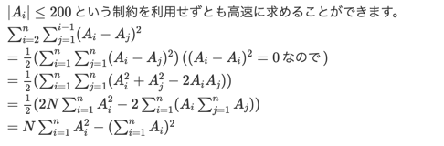

## Atcoder Beginner Contest

### abc001
- python3の四捨五入
    - round関数はくそ (切り捨て誤差が小さくなるように偶数になってしまう）
        - round(2.5) -> 2
    - 小数点がずれて怖いときは、評価する方を掛け算してあげる
    - 1123 -> 1120 にしたいとき t -= t % 5
- いもす法
    - 立ち上がりに1、立ち下がりに-1を入れておいて、最後累積和を取ることで >0 なら雨、==0なら晴れになる

### abc002
- 最大クリーク問題
    1. 所詮N = 12だから2**12で回す
    2. クリーク数決めてcombinationであるかないか、というのを友達の数でmaxとって二分探索
    3. for i in range(N) 友達増やしてみて現在の友達全員と友達かどうかを判定
    
### abc003
- 包除原理
    - 結構めんどかった. 
    - たてよこ、たてよこの組み合わせ6通り、 たてよこ３つ選んだとき、たてよこ全部
    - (1, 2, 3, 4) - (0, 1, 3, 6) + (0, 0, 1, 4) + (0, 0, 0, 2)
    - それぞれありうるかどうかの条件も必要

### abc004
- マーブル
    - 時間かかった。できるだけ関数は再利用していこう

### abc005
- imos法
    - N+1*N+1の配列を作っておけばindexが-1の例外処理がいらなくなる

### abc006
- LIS

### abc007
- 桁DP

### abc008
- コイン裏表の枚数の期待値
    - 約数を数え上げ、左側に約数が奇数枚くる確率を計算、確率がそのまま期待値になる。賢い
- 金塊ゲーム
    - メモ化再帰サイコ〜

### abc009
- 漸化式は行列の累乗を利用することでO(logn)で解ける！
- AND、XORを足し算掛け算のように扱う (半環)

### abc010
- ある点から他の点に何処か寄り道してから向かうという問題で、移動距離Lが決まっている場合楕円内にある点にならいける
- Dめちゃむずかった
marked girlのそれぞれの後ろにもう一つノードを設け、ログインできなくする工作をそのノードを切ると見なしそれぞれの工作をまとめる
最小カット最大フロー定理
ford-fulkersonのアルゴリズム
    - 適当に流す。流した流量をdとすると、流した方向のエッジに重みdを足し、逆方向を向くエッジ(capacity 0)に-dを足す (残余ネットワーク)
    - 流せなくなるまで続ける

### abc011
- 貪欲法
- combinationはパスカルの三角形使うと良いらしい

### abc012
- ワーシャルフロイドはpython通らない

### abc013
- 満腹な高橋くん(下からDP、順番関係ないからXによってのみほかが決まる)
- 巡回置換 
巡回の操作も累乗の足し算作戦
リストの削除普通にやると死ぬほど遅いので二分探索

### abc014
- 最小共通祖先 (LCA)
- pythonきびしいな〜

### abc015
- ナップザック亜種
後ろからループ回すことで品物数のループをする際メモリを使いまわせる

### abc016
- D 一刀両断
    - 交点問題
    - 直線を挟んで逆側にあるか -> 片側から見て外積の積が負
    - 線分内に交点があるか、両端からみて外積の積が負

### abc017
- 宝石と魔王ゲーム
    - imos法
- サプリメント
    - dp & imos法　難しかった
    - dp(i) にはi番目のサプリを食べおわったときの組み合わせ

### abc018
- ひし形カウント 難しかった ある方向に関して両側開いてるマス数を保存しておく
- 半分全列挙

### abc019
- 木の直径
    - ある点（なんでも良い）から一番遠い点xからみて一番遠い点yとすると、x-yの距離が直径

### abc020
- ダイクストラ & 二分探索
- D LCM Rush
    - 概要
        - Σ{i..N} LCM(i, K)
        - N, K < 10^9
    - 解法
        - 前提として、LCM(a,b)=a*b/gcd(a,b)なのでgcdを基本に考える
        - 部分点 (K < 100)
            - gcd(i, K) = gcd(i, K+i)なので、mod K はすべてgcd同じ
            - 0..K-1までの各iで、(i,i+K,..,i+(n-1)K) * K / gcd(i, K)すればいける
        - 満点
            - gcdの取りうる値は、Kのすべての約数
            - gcd(i, K) = dとなる iの和 (i < N)を求めることができたら、すべてのdで足せば答え
            - gcd(i, k) = 1となる iの和 (i < n))
                - 例えばn=6, k=6だとすると、
                - 全部 - (2で割り切れる) - (3で割り切れる) + (2, 3で割り切れる)
                - となるので、kを素因数分解して、包除原理で和を求めることができる
            - gcd(i, K) = dとなるiの和 (i < N)
                - = gcd(i, K/d) = 1 となるiの和(i < N/d))
                - となるので、これを繰り返せばOK
    - まとめ
        - lcmをgcdの問題に変える
        - gcdがある値dになるようなi、が何個あるかをそれぞれ考える
        - 素因数を列挙して包除原理すると、互いに素な数の和を求めることができる
        - 各gcdに関して、N,Kを割り算することで互いに素な数の和に帰着できる

### abc021
- DAGの数え上げ ダイクストラで最短経路出してからメモ化再帰
    - queue突っ込んだ順に取り出す方式なら、初めて通ったノードは確実に最短経路 
    - 二回目以降は、最短経路と同じなら足す
- nHr

### abc022
- 最短閉路
    - 閉路はスタートのノードを除けば経路になる 
    - ワーシャルフロイドで全点対最短距離を求めておいて、スタートに接続するノードを２つ選ぶ 
    - $O(N^3) + O(N^2)$ \\
    - ダイクストラで最短経路木求めながらスタートから生える枝にIDをつける
    - 最短閉路は
    - ある枝の途中からスタートに帰ってくる場
    - ある枝から他の枝に移動して返ってくる場合のどれか
    - $O(N^2)$
- 天体の膨張
    - 平行移動、回転によって影響を受けない距離の比を考える
    - 全天体の距離の総和、最近点の長さ、最遠点の長さ、重心からの最近点、最遠点の距離

### abc023
- 収集王
    - 縦横の和がある数字に まとめてから
- 射撃王
    - 最小化問題を直接解くのではなく、あるxが条件を満たすかを確認、xを二分探索

### abc024
- 民族大移動
    - 貪欲法
- フェルマーの小定理

### abc025
- ゲーム木探索
- 25個の整数
    - 難しかった

### abc026
- 数値計算の二分探索

### abc027
- ロボット
    - ある時刻において右に動いた場合の将来的な収支は計算できる
    - 高い順に並べて低いところで左に行けばいい

### abc028
- 特になし

### abc029
- 特になし

### abc030
- 特になし

### abc031
- 語呂合わせ
    - 文字数先に決めてしまって確認

### abc032
- ある積以下の最長部分列
    1. 1は積に影響しないのでまとめる, 10**9は実は掛け算だとO(logN)だからそんな大したことない 
    2. 尺取法 O(N)
    3. logとると和になるので、累積和が使える。長さｘを二分探索 O(NlogN) (誤差めんどくさそう）
    4. 現在の最大の長さ以下の探索はしなくてよいので、尺取法において一つ減らすだけで良い
- ナップサック
    - 価値でDP
    - n少ないがW,Vに上限がない場合 ２つに分けて全組み合わせ列挙 -> いらないのはぶいてそれぞれいい感じに突き合わせる（二分探索）

### abc033
- abc簡単
- D 三角形の分類
    - １点を決めてnC2の三角形を調べる。これをn点分繰り返す。
    - 鈍角と直角の数だけ管理して、鋭角は最後に全体から鈍角と直角を引く。
    - （鈍角、直角はダブルカウントすることがないため）
    - ある辺を決めたら、角度の差θとして θ==90, 90<θ<180となる辺を数えればよい。
    - 角度でソートすると、角度の差が単調増加になるので二分探索か尺取り法が使える。
    - 尺取り法はi,l,rの変数が必要なのでやや面倒。

### abc034
- B - ペア
    - 100 -> 101, 101 -> 100 n^1
    - 99 -> 100, 100 -> 99 (n-1)^1+1
- D 食塩水
    - 最大化問題を直接解くのではなく、あるxが条件を満たすかを確認、xを二分探索

### abc035
- 有向グラフにおける行きと帰りの最短距離 -> 帰りは矢印を逆にしてダイクストラ

### abc036
- treeDP
    - いい問題だった。自分が白の組み合わせと、どちらでもいい組み合わせの漸化式

### abc037
- pythonおせえ〜

### abc038
- BIT, LIS
    - (i&-i) で rightmost set bit だけ取り出せる

### abc039
- 特になし

### abc040
- union-find木

### abc041
- bitDP, 2**nのDP

### abc042
- 行けない場所があるときのグリッドの経路組み合わせ

### abc043
- アンバランス

### abc044
- 選んだ合計の平均がA -> それぞれの要素を x - A とすると合計が0になればいい

### abc045
- D - すぬけ君の塗り絵 / Snuke's Coloring
    - 概要
        - H*WのマスのN個を黒く塗られている
        - 全3x3の領域でk個塗られているものが何個あるかをk=0~9まで数える
    - 解法
        - H,Wが10^9なので普通には無理。
        - 座標圧縮したくなってしまったけど、x,yが単調増加でずっとあると、圧縮後もそれぞれ10^5あるから無理だった。
        - 関係あるのは黒く塗られているところなのでその周辺を見ればいい。
        - 近くに黒丸が２つあるとダブルカウントしかねないので覚えておく。

### abc046
- C - AtCoDeerくんと選挙速報
    - ある値bを超えるようなaの倍数を求めるだけ
    - max(((t + T[i] - 1) / T[i], (a + A[i] - 1) / A[i]))
    
- D - AtCoDeerくんと変なじゃんけん
    - グーを出した回数しかパーを出せないじゃんけんの戦法
    - 相手も同じ戦法になってることに気づくのに時間かかった。
    - 相手が無駄にグーを出してる数だけが重要。
    
- E - AtCoDeerくんと立方体づくり
    - 概要
        - 4隅に色がついている正方形がたくさん
        - 正方形を6枚えらんで立方体をつくる。接する頂点の色は同じである必要。
        - 立方体が何通りあるか
        - 回して一致するなら同じ立方体とする
    - 解法
        - 上面を一番小さい数にして向きも固定すれば、まわして一致のダブルカウントを防げる
        - 下面と向きを固定すると頂点の色が確定する
        - 横の面の組み合わせを考える。
        - 上面と下面と同じやつを使ったらだめで、横には一種類しか使ったらだめ
        - 色の組み合わせをmapでもって、使った正方形を回した4組をmapから消す。
        - 4色をmapのキーにするときpairでやっちゃったけど、ハッシュ化したほうが良い 

### abc047

- B	すぬけ君の塗り絵 2 イージー / Snuke's Coloring 2 (ABC Edit)
    - 領域狭めてくやつ
    - 超愚直に塗ったが、白の領域は内部の長方形なのでl,r,u,dを覚えておけばよかった。
    	
- C	一次元リバーシ / 1D Reversi	
    - 文字列の変化点をかぞえるやつ
    
- D	高橋君と見えざる手 / An Invisible Hand
    - 問題設定ややこしい。
    - 結局i,jのペアでaj-aiが最大となるやつの組み合わせの数。
    - なぜか二分探索木で最大を求めてmx-aiで求めたが、最小値を覚えながらai-minでよかった。

### abc048

- C	Boxes and Candies
    - 概要
        - 配列の隣り合う要素の和がxを超えないように、各要素を引く。引く必要のある合計
    - 解法
        - はじっこより真ん中を引くほうが絶対良いので、貪欲
        - 一回WA
            - 要素を0未満にはできないのが漏れていた
            - 0未満にしないといけない場合は、すでに考慮した左側のやつから引く。
            - x>=0なので、左を引ききってもだめな場合はない。
        
- D	An Ordinary Game
    - 概要
        - 文字列から文字を消していく。消したあとに隣り合う文字が同じになる場合は消せない。
    - 感想
        - つらかった。
        - 消す順番によって結果が変わるような気がしてしまいこんがらがってとけず。
    - 解法 
        - 最終状態は、abababa もしくは abababになるのは間違いない。
        - うまく順番変えれば真ん中のやつは消せるなぁとか考えてたけど、消せても2個単位なので、勝敗には関係ない。
            - ここがわからなかった。
        - つまり、最終状態の文字数の遇奇は確定してるので勝敗も確定している
        

### abc049
- C	白昼夢 / Daydream
    - dream, dreamerで作られた文字列か判定
    - 前から見ると分岐が生じるので後ろから見る
    - 後ろのidxを持ってsubstrしたが、全部ひっくり返して前から見る作戦もある。
- D	連結 / Connectivity
    - 線路による連結成分と、道路による連結成分がそれぞれある。
    - どちらでも連結していることの判定
    - UnionFindをふたつもって、rootのidxのペアが一致していれば連結していると言える。
    - ペアをmapでもてば、どちらでも連結している都市の数がわかる。

### abc051
- C	Back and Forth
    - 点から点へ向かう4通りの矢印書いていくだけ。
    - 正負の処理の共通化を少しきれいに書けた。
    
- D	Candidates of No Shortest Paths
    - 最短経路としてつかわれない辺の数
    - ワーシャルフロイドして、全点間最短距離を出しておく。
    - dist[i][j] < edge[i][j]だったらその辺は使うことはない。
    - 逆にそうでなければ、少なくともそのi, jの最短経路に使うのでOK。(等号の場合も同じ)
    - つまりこれだけ。解説より簡単そう。

### abc052
- C - Factors of Factorial
    - N!の約数の総数

- D - Walk and Teleport
    - 歩いて移動するか、テレポートするか
    - 結局隣に歩くかテレポートしかないので、貪欲

### abc055
- C	Scc Puzzle
    - めっちゃかんたん 
    
- D	Menagerie
    - 概要
        - 動物が円環上に並んでる
        - 正直者、嘘つきのどちらかわからない動物が、それぞれ、自分の両隣が同一か異なるかを答えているのが与えられる
        - 矛盾しない組み合わせがあるかどうか
    - 解法
        - ２匹の正直or嘘つきを仮定すると、自動的にすべての組み合わせが決まる。
        - 最後まで求めたときに最初の仮定と矛盾しなければOK。
        - 2匹の組み合わせを4通り試すだけ

### abc056

- C	Go Home
    - 問題
        - 時刻iに、x-i, x, x+iに移動できる
        - Xにたどり着く最小の時刻
    - 解法
        - n*(n+1)/2 >= xを満たす最小のnを考える
        - どこかの時刻tで戻った場合は、n*(n+1)/2 - 2*t, stopなら n*(n+1)/2 - t
        - という感じで調整ができる。
        - n*(n+1)/2 - x < n　なので、この調整でどうにかなるので n が答え
    
- D	No Need
    - 問題
        - 総和がK以上になる部分集合を良い集合という
        - カードiを含むよい集合のうち、iを除くと総和がK未満になってしまうものがない ⇛　カードiは不要
        - 不要なカードの枚数を求める
    - 解法
        - カードiを使わずに取りうる和は、dpでO(NK)で求まる
        - K-a[i] ~ Kの和のうちどれかを作れるなら、カードiがあるおかげで良い集合になるような部分集合があるということ
        - どうやったら戻すDPができるかなーと考え、よくわからず、
        - 明らかに、大きいカードのほうが必要なので単調性があるので、にぶたんで上記を毎回やった。
        - O (NKlogN)
    - かっこいい解法
        - 0 ~ iまでを使った時点での取りうる和のdp配列と、
        - N ~ iまでを使った 時点での取りうる和のdp配列　をもっておけば、
        - 各iを使わなかった場合の取りうる和をO(K)で求められる。
            - やや語弊があり、0-i, i-Nの和で K-A[i]~Kのものがあるかどうかがわかる
        - この場合O(NK)
        

### abc058

- C - 怪文書
    - 各文字列の中で、各文字の出現回数が最小のものの数をもとめ、足すだけ

- D - 井井井 / ###
    - 概要
        - 縦n本、横m本の直線から作られるすべての長方形の面積の総和
    - 解法
        - 縦、横は独立で考えることができる。
        - 各辺が何回使われるか、を求めて、それの縦と横をかければいい
        - 真ん中のほうがいろんな幅で何度も使われる、的なルールからがんばって数式求めた
        - n=7, k=1だと、1111111, k=2だと1222221という感じなので、
            - 1,2,3.. (k(k+1/2))を両端分と、真ん中がkがn-2k個 (あとから見返して自分のコードが理解できなかったのでメモ)
    - 解法2
        - 幅に変えたが、座標のまま扱ったほうが簡単そう
        - 座標だと、sum (xi - xj) (0<i<j<n)
        - 座標xkが、左側に出てくる回数と右側に出てくる回数は、それぞれk-1, n-kとわかる
        - つまり、sum( (k-1) * xk - (n-k) * xk) 0<k<n をやるだけ
    - やらかし
        - 自分のmodintライブラリ、long longとの+=がおーばーろーどされておらず、
        intの +=が使用されていた？のかうまく通らなかった。。
        

### abc059
- C. Sequence
    - 概要
        - すべてのiに対して、ai+1までの和の符号がaiまでの和の符号と異なるようにする。
    - 解法        
        - 1番目を正にするか、負にするかを２通り試す。
        - 決めたら、和をとって前回値と同じだったら+1か-1まで変更する。
        - iの値の変更とi+1の値の変更が結局同じなので、貪欲にいける。
    
- D Alice&Brown
    - 概要
        - X,Yの数があり、かたっぽから2i引いて、もうかたっぽにi足す
        - 操作ができなくなったら負け
    - 解法
        - (0,1),(0,0),(1,0),(1,1)が負け 
        - 操作により、X-Yは3iずれる。
        - 実験すると、|X-Y| < 1のとき、負けっぽい
        - X-Y>1 && X-Y ≡ 1のとき X-Y=1にできる
        - X-Y>1 && X-Y ≡ 2のとき X-Y=-1にできる
        - 的な感じで, |X - Y| > 1なら、|X - Y|=-1,0,1のどれかにできる。
        - 結局初手が|X-Y|が1より大きいからそうでないかでわかる 

### abc060

- D - Simple Knapsack
    - 概要
        - ナップザック
        - N < 100, W < 1e9, V < 1e9
        - Wの取りうる値は x, x+1, x+2, x+3の4種類のみ
    - 解法
        - N個全ての組み合わせの、Wの和の取りうる値は、
            - x~x+3, 2x~2x+6, ... Nx~Nx+3N
            - 4+7+..+3N+1 =  N * (3N+5) / 2なので、N=100でも10000程度
        - なので、dpを配列でなくmapで管理すれば、N * 10000なので間に合う
    - 解法2
        - 重さが4種類しかないので、勝ちごとにソートしておくと
        - どの重さから何個使うか、を決めると価値が大きいから使うのが最適
        - (N/4)^4で全探索できるので、どの重さから何個使うかを全部調べていける

### abc061
- C - Big Array
    - 概要
        - 数aをb個加える、をn回やったあとに、k番目に大きい数を求める
        - n, bが10^5なので配列の数は10^9となる
    - 解法
        - aを小さい方から足せばOK
    
- D - Score Attack
    - ベルマンフォードで終わり。

### abc062

- C : Chocolate Bar
    - 概要
        - H, Wの長方形を3つの長方形にわける
        - Smax - Smin の最小値
    - 解法
        - 普通に考えると結構むずい
            - W/3あたりを何個か試す感じになるのかな
        - どこで切るか決めると、残った長方形の切り方は、真ん中で切るのが絶対良い
            - h, wのどちらかが偶数だったらきれいになって終わり
            - どっちも奇数だったら、h,wの小さい方の辺をかたっぽに割り当てるのが差が小さい

- D : 3N Numbers
    - 概要
        - 3Nの配列から、N個取り除いて、前半N個の和 - 後半N個の和の最大値
    - 解法
        - k番目の左を前半、右を後半と決めると、それぞれ小さい、大きいものを削除するのが最適とわかる
        - priority_queueで、最大、最小を管理しながら、独立にk番目まで左側、としたときの最適値を計算していけばおｋ 

### abc065

- D - Built?
    - 概要
        - N個の街が2次元平面上にある
        - 座標(a,b)<->(c,d)間を行き来する道を作るにはmin(|a-b|, |c-d|)コストがかかる
        - すべての街を行き来できるようにするための最小のコスト
    - 解法
        - min(|a-b|, |c-d|)とあるが、|a-b|, |c-d|でそれぞれ作っても最小全域木で小さい方は消えるので、どっちも作って良い
        - 全2点間に道を作って最小全域木を作るとO(N^2)
        - x<y<zとして、(0, x), (100, y), (200, z)の街があったとして、
            - |x-z| = |x-y| + |y-z|なので、街1, 3に道を貼る必要はまったくないとわかる
        - ので、x方向、y方向にそれぞれ一番近い街に貼った道を候補として、最小全域木すればOK

### abc066

- D - 11
    - 概要
        - 1..nからなり、長さn+1個の数列A
        - k個の部分列の個数
            - 部分列が同じだったら、取り出す位置が異なっても1個とする
    - 解法
        - 1つの整数だけ、2回出てくる
            - --- x ----- x ----
        - 方針として、全体から、2回出てくるやつのせいで部分列がおなじになってるやつを引く
        - 真ん中を選ぶ場合は、同じにならない
        - 左、右からk-1個選んで、xを選ぶ場合、xのどっちをとっても同じ部分列になる
        - つまり 全体 n+1 C k  - L+R C k-1 が答え             
    
### abc067

- D - Fennec VS. Snuke
    - 概要
        - 木のあるマスが黒、あるマスが白、それ以外は塗られていない
        - 先手は、黒の隣接マスを黒く、後手は白の隣接ますを白く
        - どっちが勝つか
    - 解法
        - なんか最初に説いたときLCAとかやってて馬鹿
        - 白、黒をつなぐ最短経路をそれぞれ塗っていくのがお互い最適
            - それ以外は後でいつでも塗れる
        - 更に考えると、結局、あるマスは、初期の黒、白に近い方の色になる
        - それぞれからDFSして距離求めたら、終わり。          
    
### abc070

- D - Transit        
### abc071

- D - Coloring Dominoes
    - 2 * Nマスに、敷き詰められたタイルの色の塗り分け方
    - タイルは2x1, 1x2しかない。
    - タテ->タテ: 2、タテ->ヨコ: 2, ヨコ->タテ: 1, ヨコ->ヨコ: 3 通り濡れる
    - 書くだけ。
    
### abc079

- D - Wall
    - 概要
        - 数字i -> 数字jに変えるのに C[i][j]かかる
        - すべての数字を1にするコスト
    - 解法
        - C[i][j]に対してワーシャルフロイドすると、各iからの最短経路がわかる
        - 足すだけ
    - 反省
        - i, j, kの順でループしてしまってWAした。
        - k, i, jじゃないとだめ。

### abc080

- D Recording
    - 概要
        - C個のチャンネルで、N個のテレビ番組が放映される
        - i個目の番組はチャンネルc[i]で[S[i], T[i])まで放映される
        - 一つの録画機で、一つのチャンネルを録画できるが、S[i]-0.5からT[i]まで他のチャンネルは録画できない
        - 録画機は何個必要か。
    - 解法
        - 基本的に重なった部分の最大値を答えればいい
        - T[i]とS[j]がかぶった場合、同じチャンネルだったら一つの録画機でいけるけど、違うチャンネルだったら2個必要
        - 先に同一チャンネル内で連続してるところをマージしておけば、適当にimos法すれば良い
        - 遅延セグ木で殴っちゃったけど

### abc081

- D  Non-decreasing
    - 概要   
        - 整数列A[N]に対して、以下の操作を2N回以下行うことで非減少列にできるかどうか
        - 操作
            - A[j] += A[i]とする
    - 解法
        - 全て正だとすると、a0, a0+a1, ..., a0+a1..+anとすれば非減少とできる
        - 負でも、全部負だったらおんなじようにいける
        - 正、負が両方ある場合、max(正)>min(負）だったら、max(正）で負を全部1回の足し算で正にできる。
        - max(正)<min(負）だったらmin(負）によって全部負にできる
     
### abc082

- D  FT Robot
    - 概要
        - F,Tからなる文字列Sがある
        - ロボットは、Tだったら90度好きな方向に回転、Fだったら向いている方向に1マス移動
        - ゴールx,yに最後いることができるか。
        - 最初は右を向いている。|S|<=8000
    - 解法
        - 最初全然わかんなかったけど突然わかった。
        - F, Tをまずまとめる。
        - すると、Tで区切ったときに上下方向、左右方向に移動を分けることができる
        - dp[i][j] : i回目にjにいることができるか
            - dp[i][j-f[i]] <- dp[i][j], dp[i][j+f[i]] <- dp[i][j]
            - これを上下、左右それぞれでやる。
        - 注意しないといけないのが、左右方向の最初は右に移動しないといけない。
            - また、TTFFとか、TFTFから始まってたら左でも良い。

### abc083

- D Wide Flip
    - 概要
        - 0,1からなら文字列S
        - K以上の連続する区間の反転操作によって、Sを全て0にできるような、最大のK
    - 解法
        - 意外とむずかった
        - 左からk+1番目の数は、左からk+1個反転させてからk個反転させれば自由に操作できることがわかる
        - ひっくり返さなきゃいけないもののなかで、左右から一番遠いものを求めたら答え。
    
### abc084

- D: 2017-like Number
    - 概要
        - Nが奇数、Nが素数、N+1/2も素数、であるようなNを2017-likeとする
        - Q個のクエリに対して、L[i] <= x <= R[i]のうち2017-likeなxの数を答える
    - 解法
        - エラトステネスの篩で先に数えといて累積和でえいや
    
### abc085

- C	Otoshidama
    - 概要
        - X + Y + Z = n
        - 10000*X + 5000*Y + 1000*Z = A
        - となるX, Y, Z
    - 解法
        - X, Yでループするだけでいいやつ
        
- D	Katana Thrower
    - 概要
        - 刀がN本
        - 刀iは、斬りつけるとai、投げるとbiのダメージ
            - 投げると二度と使えない
        - Hを超えるための最小の攻撃回数          
    - 解法
        - 投げるか、切りつけが一番強いやつa0で攻撃するのが良いのがわかる
            - 切りつけ終わってから、全部投げれば良い。
        - なんとなくにぶたんっぽかったので、
            - x回の攻撃で与えられる最大のダメージ
            - a0より強いやつをx回まで投げる。
            - 残りはa0で斬りつける。
            - が最適
        - 実際は、にぶたんじゃなくて、
            - bの降順に累積和取りながら、 i + (H-sum(bi))/a してmin取れば良い。

### abc086

- D Checker
    - 概要
        - 無限のグリッドを、KxKの市松模様で塗る
        - N個の希望があり、希望iは、xi,yiを黒or白にぬりたいというもの
        - 市松の塗り方を工夫して、叶う希望を最大化
        - K <= 1000
    - 解法
        - 2Kx2Kで周期的なので、座標は2Kでmodを取って良い。
        - また、xを白で塗る希望は、x+Kを黒で塗るのと同じ希望
        - 全部KxKの中に収めることができる
        - KxKの各マスに対して左上が白or黒で塗るとして、2次元累積和で希望数を数える
    - その他
        - 2Kx2Kとすると、黒の領域をたくさん入れないといけなくて大変だなぁと思っていたが、
        - x+2Kにも同じものをコピーして、各マスからi,j,i+2K,j+2Kの領域を累積和計算のほうがスマート

### abc087

- D People on Line
    - 概要
        - X[R[i]] - X[L[i]] = D[i]
        - という情報がM個与えられる
        - 全てに矛盾しないようなXが存在するかどうかの判定
    - 解法 
        - 重み付きUnionFindで殴れる
            - l -> r の重みがdになるようにunionして、
            - sameだったときにdiffがdじゃなかったらだめ
    - 想定解法
        - 頂点l -> 頂点rに重みd, 逆向きに重み-dの辺を貼ったグラフを作る
        - 頂点0に0とか割り当てて、幅優先とかしながら、重みに従って頂点に数字を割り当てて、矛盾したらだめ。
    

### abc088

- C: Takahashi’s Information
    - 概要
        - C[i][j]が与えられ、C[i][j] = A[i] + B[j]であるとの情報があり、これが真か
    - 解法
        - C[i][j]-C[i+1][j]==C[i+1][j] - C[i+1][j+1]かどうかを全部調べた
        - スマートな解法
            - A[0]=0としてよく、するとB[j]が全部決まる。
            - するとA[1:]も全部決まる
            - ので、あとは確認すれば良い

- D: Grid Repainting
    - グリッドのBFSするだけ。
    
### abc089

- D Practical Skill Test
    - 概要
        - HxWマスに整数が1~H*Wまで書かれている
        - マスi,jからx,yに移動するのに|x-i|+|y-j|のコスト
        - 整数aが書かれているマスから整数bまで移動する
        - 移動は、a, a+D, a+2D,...,bの順番で移動する
        - b - a はDの倍数
        - Q回a,bが与えられるのでその時の移動コストの和
    - 概要
        - 先に移動コストの累積和を計算しておく。
        - 各整数をDのmodごとに分けて計算したが、
        - 別に分けなくてもそのままdp[i] = dp[i-D] + |x-i|+|y-j|でやってよかった

### abc090
- D Remainder Reminder
    - 概要
        - N以下の非負整数a,bで、a % b >= Kとなる物の数
    - 解法
        - bを固定すると、a = nb + rでr >= Kとなるものを数えれば良い
        - 0 <= n < N/bのときは r=0..b-1で、n = N/bのときは r=0..N%b
        - K=0のとき、a=0の処理が地味に面倒だから先にN^2として答えとく
        - a=0のときを含めて考えて、あとから引いても良い。
    
### abc091

- C 2D Plane 2N Points
    - 概要
        - 青、赤の点がNこずつ
        - 赤x<青x and 赤y<青yだったらペアにできる。
        - 作れるペアの最大
    - 解法
        - 青の一番xが小さいやつは、赤のxそれより小さいうちyが最大と組んで良い。
    - 解法2
        - 最大フローの二部マッチングでもOK
    
- D Two sequences
    - 概要
        - A[N], B[N]の N^2通りの和A[i]+A[j]のxorを求める
    - 解法
        - 桁ごとに考える。
        - A[i]ごとに、和のd bit目に1が立つようなB[j]が何個あるかを考える。
        - このとき、A,Bのd桁目より大きい部分は無視できるのでマスクする
        - T=2^dとすると、和が[T,2T), [3T, 4T)だったら1が立つ
        - つまり、Bをマスクしたやつをソートしておけば二分探索で1が立つやつを数えられる
        - O(d Nlog(N))
        - 
### abc092
- D - Grid Components
    - 概要
        - 二次元グリッドを黒、白のどちらかに塗る
        - 黒の連結成分の数がA個、白の連結成分の数がB個、になるような塗り方を一個作る
    - 解法
        - 構築系　
        - |..............
        - |.#.#.#........
        - |..............
        - |##############
        - |#.#.#.########
        - |##############
        - みたいにやると、上下で自由に連結成分を増やせる
    - 公式
        - まず上下を全て黒白で塗る。
        - その後A-1個、B-1個適当に塗る。ほうが実装しやすい

### abc094

- D Worst Case
    - 概要
        - 2回のコンテストで、A位、B位取った人がいて、
        - 2回の順位の積がこの人よりも小さい人の人数の最大値
    - 解法
        - A<=Bとすると、A-x位取った人は、B+x位取ればA*Bより小さくなる
        - B-x取った人はA+xでよいかは怪しい。
    - 公式解法
        - よくわからなかった。
        - 大体のケースでC=√ABとして、C位までのマッチングでいい感じにできて、
        - できないケースを場合分けしているが、むずい
    - その他解法
        - 1..x位まで考えるとしたら、基本的なマッチングは (1,x)...(x,1)を組ませるのが最適
        - また、その時の積の最大値は大体中間（x/2, x/2)くらい。
        - この積がABを超えない最大のxを二分探索で求める
        - ただし、A位、B位は取らないのでケアが必要
    - kmjp
        - https://kmjp.hatenablog.jp/entry/2018/04/07/0900
        - A-1を先にケアしてる。実装が簡単
        - 0~A-1とB+1~B+A-1をマッチングさせると、無駄になることがないので先にやってよく、
        - 間のマッチングを考える問題にできる。

### abc096
- D - Five, Five Everywhere
    - 概要
        - 55555以下の素数からなり、全て値が異なる要素Nの配列a[N]で、
        - a[N]からどの5個を選んでも、和が合成数になるようなものを作る
    - 解法
        - 5で割って1余る素数で埋められたら、5個選んだら5の倍数になるので、これだけ

### abc097
- C - K-th Substring
    - 概要
        - 文字列Sの全てのユニーク部分文字列のうち、辞書順でK番目のもの
        - |S| <= 5000, K <= 5
    - 解法
        - 全部考えてソートすると、|S|^3かかる
        - Kが小さいので、setでK個小さいのを持っておいて逐次一番小さいのと比較して、
          持っているのとかぶっていなければ更新
    - 公式
        - 明らかに、長さがK以下であることがわかる
        - |S|*5で全部作ってソートがらく

- D - Equals
    - 概要
        - 順列Pが与えられ、以下のM個の操作を何回でもできる
        - 1<j<Mで、xjとyjの要素をswapする。
        - pi=iとなる数の最大
    - 解法
        - 各idxをノード、xi, yiを辺とするグラフを考える
        - iとpiが同じ連結成分にあれば、pi=iとできるのでそれを数える
        - なんか無駄に連結成分ごとにまとめてしまったがuf.same(i, p[i])で良い

### abc098

- D - Xor Sum 2
    - 概要
        - 配列A
        - Al + Al+1 + ... + Ar = Al xor Al+1 xor ... xor Ar
        - となる (l, r)の組み合わせ
    - 解法
        - a + b = a xor bとなるのは、a & b = 0のとき
            - a, bどちらも1となるbit位置がないこと。
            - （繰り上がりが発生しなければ同じ。）
        - 尺取法でいける
            - cur & A[r] == 0であるかぎり、rを伸ばして良い
            - ==1になったら、cur ^= A[l] で lを伸ばせる
    
### abc099

- C Strange Bank
    - 概要
        - 1回で6^p, 9^p (p>=0)の金額を引き出せる
        - Xの金額をちょうど引き出すために何回かかるか (X<1e5))
    - 解法
        - Xが小さいので使いうる6^p, 9^pを用意してdpするだけでよい
    - 公式
        - 6^pだけを使って引き出す数をx、X-xを9^pで表すと考える
        - それぞれ6進数, 9進数として表すことを考えれば最善の表し方が考えられる。
    
- D Good Grid
    - 概要
        - NxNのグリッドに色が塗られている（C<=30)
        - (i+j)%3 == (x+y)%3 ならそれらは同じ色、違うなら違う色、になるように色を塗り替える
        - 元々の色x -> 色yに変える際Dxyのコストがかかる
    - 解法
        - 結局3色のどれかに塗ることになり、Cが小さいので、nC3を試せば良い
        - 毎回NxNのグリッドを試すと時間かかるが、先に(i+j)%3の色を全てある色に変えるコストを計算すれば、O(C^3)で終わる

### abc100

- C	*3 or /2
    - 2で割れる回数を求めるだけ。
    - 貪欲に2で割っていって求めたが、二分探索で割れなくなる数を求めるとさらに高速化できる。
    
- D	Patisserie ABC
    - N個のケーキがあり、x, y, zの3つの指標がある。(それぞれ負もある)
    - M個食べて、x,y,zの合計の絶対値の最大値
    - 普通にやるとむずいので、x,y,zそれぞれについて、正の方向で最大化するのか、負の方向で最大するのか、8通り全部調べる。

### abc101

- D Snuke Numbers
     - 概要
        - 各桁の和をS(n)とする
        - nより大きい全ての整数mに対して、n/S(n) <= m/S(m)が成り立つnをsnuke numberとする
        - K番目のsnuke numberを求める
        - 答えは 1e15以下である 
     - 解法
        - 実験すると、末尾に9が並ぶのが良さそうとわかる
        - ただ、109はNG。1099はOK。2099はNG、とちょっと難しい。
        - 解説呼んだけど正直良くわからん。
        - https://drken1215.hatenablog.com/entry/2018/06/24/010600
        - 自分で解くならこれになりそう。
        - 数をabcd99999と考えたときに、何桁9じゃないやつがいても候補となりうるかを考える
        - p*10^d - 1 としたとき、(p+1)*10^d - 1が候補になりうると考えると、
        - p が f(p)よりなんとなく小さいやつじゃないといけなくて、f(p)=9*15=135くらい。
        - dを15, p=150くらいまでを見て条件を満たすか見れば良い。
        - なんかよくわかってないけどもういいやという感じ
### abc102

- C	Linear Approximation
    - |ai-b|が最小となるbを求める
    - bがaiのmedianのとき最小なので、ソートして終わり
    
- D	Equal Cut
    - 数列を4つに分割して、それぞれの和P,Q,R,Sの最大値と最小値の差の最小
    - P,Qの差の最小化だけを考えるなら、P+Q/2に近いところで切るのが最適。
        - これは累積和でにぶたんすればlogN
    - つまり、Q,Rをどこで切るかを全探索して、P,QとR,Sの切れ目は貪欲で決まる
    - P+Q/2に近いところできる実装がめんどかった。**まだいい感じの実装わかってない**

### abc103

- C	Modulo Summation
    - f(m) = m % a_1 + ... + m % a_n
    - f(m)の最大値
    - m = a_1 x ... a_n - 1とすると、それぞれの項でa_i-1にできるので最大。
    
- D	Islands War
    - 島aと島b間が行き来できないようにはしを落とす。
    - 区間スケジューリング
    - bでソートして、すでにa以降で橋を落としていればそのまま、そうでなければ落とす貪欲
    

### abc104

- C all green
    - 間違えた。。。
    - にぶたんしたくなるが、全完するセットをbit全探索
        - にぶたんで、全完した場合の一問あたりの得点と全完しない場合の得点を同じリストにいれて貪欲した
        - Aが全完可能の場合で、その次に選ぶ全完しない問題の得点が低い場合がある
        - その場合、Bを全完してAをちょっと解くほうがいい場合がある、ので貪欲はだめ。
- D we love abc
    - 概要
        - ?ABCを含む文字列からS_i,S_j,S_kがABCになるような組み合わせ
        - ?は全通り考える。
    - 解法
        - あるiまでに作れるAB(?を考慮する)の数を覚えておく
        - ?が出た場合、iまでに作れるABを3倍して、今までのAと?で作る、今までの?と?で作れる場合
        - C, ?が出たらans += AB, ?の場合は今までに作れるABCを三倍する必要もある    

### abc105

- B Cakes and Donuts
    - 4A + 7B = NとなるようなA,Bが存在するかどうか。
    - 解法自体は全探索するだけだが、
    - N>=21なら、N,N-7,N-14,N-21の中に4の倍数が存在するので、必ず存在する。面白い。
    
- C Base -2 Number
    - 与えられた数字を-2進数表示。
    - 結構時間かかった。。
    - また1 << iでlong longにしてなくてオーバーフローやってしまった。。
    - 自力解法
        - i番目のbitが1だったときに取りうる値の範囲を求めて計算した。
    - 想定解法
        - 2で割ったあまりに寄与するのは結局 0bit目のみ。
        - 同様に、4で割ったあまりに寄与するのは0,1bit目のみ。
        - つまり順々に決まる。
        - それはそう。。
        
- D Candy Distribution
    - ABC146E Rem of sumの簡単版
    - 問題
        - Al + .. + ArがMの倍数となるようなl,rの組み合わせ
    - 解法
        - Al + .. + Ar = S_r - S_l ≡ 0 (mod M)になっていればよい。
        - つまり、累積和をとったときに、あまりが一致していれば良い。
        - 左から累積和を計算しながら、過去に現れたあまりの数をカウントアップしていけばよい。

### abc106

- C	To Infinity
    - 5000兆日目のやつ。K番目までに1以外が現れたらそれ。現れなかったら1
    
- D	AtCoder Express 2
    - 概要
        - L,Rの区間を走る電車がある
        - 区間p,qに 走行区間が完全に含まれる電車の数はいくつか。
    - 解法
        - 結構むずかしいとおもうけど。。
        - 各電車のL, Rを二次元座標にマッピングする。
        - するとp, qに含まれる⇛二次元座標で長方形に含まれる電車の数。
        - 二次元累積和でとける。

### abc107

- B	Grid Compression
    - "#"がないところを消すやつ
    - "#"の数を数えちゃったけど、"#"が出たらtrueにして、あとでfalseを除けばよかった。
    
- C	Candles
    - ろうそくをK個灯すための最小移動距離。
    - 行って戻る系。
    - ばぐらせた。。
        - 負⇛正に変わるところのidxを計算してたが、正がない場合はidx=N。N-1ではない！！ 
    - 最小値系は、無駄なところを計算して問題ない。
        - （行って戻る必要があるのは明らかに連続するK個の領域の内部にスタートがある場合だが、そうでない場合をがんばって計算しないようにする必要はない。)
        -     REP(i, n-k+1) {
                  ans = min(ans, abs(x[i]) + abs(x[i+k-1] - x[i]));
                  ans = min(ans, abs(x[i+k-1]) + abs(x[i+k-1] - x[i]));
              }
        - こんなんでよい。        
- D	Median of Medians
    - 例の
    - 中央値 ⇛ x以上の値がceil(M/2)個あるようなxのなかで最大値
    - にぶたん && 累積和 && BITによる転倒数カウント

### abc108
C - Triangular Relationship
    - a+b, b+c, c+aがKの倍数となるようなa,b,cの組み合わせ
    - 2*a ≡ 0 (mod K)と出てくるので、Kの遇機で分岐
    - Kが奇数なら、a,b,cが全てKの倍数であることが必要十分
    - Kが偶数なら、a,b,cが全てKの倍数か、全てKでわって(K/2)あまること
    
D - All Your Paths are Different Lengths
    - パスの通り方で0~L-1までの全ての距離を作れるようなグラフの構築
    - 2べきと0の辺をつなげていくと、0~2^r-1までは作れる。
    - 重みは自由に設定できるので、残りは途中からNまで重みをつければ、X~X+2^t-1が作れるので、
    そんな漢字で適当につなげる。

### abc109
- D - Make Them Even 
    - 各マスにコインがあって、コインが偶数になるようにするやつ
    - 奇数だったら右に移動、を貪欲にやっていって良い。最後に最終列を縦に掃除。
    - 無駄に時間かかった。

### abc110
- D	Factorization
    - a1 x a2 x ... x an = M
    - となるようなa1...anの数列の通り。（一個でも違えば良い）
    - Mを素因数分解したとき、素因数ごとに独立に考えて良い。
    - p^dとすると、d個のpをn個のグループ割り振る重複組合せ通り。

### abc112
- D	Partition
    - a1+..+an = Mを満たすa1~anの最大公約数の最大値
    - Mの約数dで、M/dがnより大きければ作れるので、約数を大きい方から見るだけ

### abc113

- D - Number of Amidakuji
    - 概要
        - 1からはじめて、K番目に到達するようなあみだくじの数。
        - 棒を連続でつけたらだめ
    - 解法
        - dp[i][k] i番目の高さで、k番目にいる数
        - 次の遷移は、連続して棒をつけない組み合わせ。
        - 全部列挙すればいい。 1 << w個
        - もしくは、dp[j] = dp[j-1] + dp[j-2]        

### abc114
- C. 755
    - 桁DPっぽくみえるが、ありうる数字を列挙して、N以下なら足していく方式。
    - わからなかった。。。
    
- D. 756
    - これは簡単だった。
    - 約数が75個あるやつを数える。
    - 約数の数は、素因数分解したときの各素数の肩の数字+1の積なので、やるだけ。  

### abc116
- D. Various Sushi
    - 概要
        - 寿司iに、美味しさと種類が割り当てられてる
        - K個選んで、美味しさの合計 + 種類数^2　の最大値
    - 解法
        - f(x) = 種類xこ選んだときの美味しさの最大値
        - 貪欲に大きい方から選んだときの種類数xkの f(xk)は自明
        - f(xk+1) = f(xk) + A - B
        - A = 貪欲に選んだときに選ばなかった種類の寿司の最大値を足して、
        - B = 今選んでるうち、種類数が減らない（2個以上あるやつ）なかから最小値を引く
        - これ続けてf(x)埋めて f(x) + x*xの最大値             
   

### abc117
- D - XXOR
    - 概要
        - A1 ~ Anが与えられる
        - X = [0 ~ K]で、
        - f(x) = (X xor A1) + ... + (X xor An)の最大値
    - 解法
        - bitごとにみたときに、明らかに A1~Anで、0,1の多い方にしたほうがよい。
        - Kより大きくならないように桁DPするか、
        - どこのbitを x < kにするかの全探索

### abc118

- D - Match Matching 自力
    - 概要
        - ある数を表すマッチを構成するには、それぞれ決められた本数が必要
        - 作れる数と、マッチ本数が与えられる。
        - 全てのマッチをちょうど使い切る条件で、マッチで作る数字の最大値
    - 解法1
        - 明らかに、桁数が大きいほうが数が大きいので、使うマッチ本数が一番少ない数をいっぱい作るのが良い。
        - ちょうど作らないといけないので、最後調整が必要
        - 一番少ない本数をk、一番少ないやつで埋めたときのあまりをrとすると、
        - r, r+k, r+2k, をちょうど作れるやつのなかで一番おおきくなるやつを作る。
        - ちょうど作れるやつはDPで作っとく。
        - みすったとこ
            - ちょうど作れるやつを見つけたらbreakしてたけどだめだった。
            - 3=5, 8=7, 9=6で 8833と9999は 8833のほうが3をいっぱい作っているが、
            - 10+14=24で使う本数が同じかつ9999のほうが大きいので、breakせずもう少し見る必要がある

### abc119

- C - Synthetic Kadomatsu
    - 概要
        - 竹を何本か選び、A,B,Cの長さの三本にする
        - +1, -1, 合体の魔法を使える
        - 最小のMP
    - 解法
        - 全ての竹をA, B, C, 使わないのどれかに割り振ったら、その後は貪欲
        - 4^Nを全探索
    
- D - Lazy Faith
    - 概要
        - 神社と寺が数直線上にある
        - ある点が与えられて、神社と寺に訪れる最小移動距離
    - 解法   
        - 左側、右側の神社と寺をにぶたんで見つける
        - 右右、右行って左左、など色々試して最小見つける
### abc120

- D - Decayed Bridges
    - 概要
        - 無向グラフの辺を順に削除する
        - ある時点であるノートとノードが行き来できるか
    - 解法
        - 削除は難しいので、逆に構築していき、UnionFindで管理

### abc121

- D XOR World
    - 概要
        - f(A,B) を A,A+1,...,B の排他的論理和としたとき、f(A,B) を求めてください。
    - 解法
        - a xor b = cとすると b = a xor cなので
        - f(B) xor f(A-1)で良い。
        - 想定解
            - n xor n+1 = 1　(nは偶数)を使うと、
            - 1 ~ 6のxorは、1 xor 1 xor 1 xor 6になる
        - 自力解
            - bitごとにそのbitが立つのが何個あるか頑張って計算 
        
### abc122

- C - GeT AC
    - Sの[l, r)の'AC'の数。累積和のもちかた、ちょっと考える必要
    
- D - We Like AGC
    - 以下の長さNの文字列の数
        - AGCTしか含まない。
        - AGCを部分文字列として含まない。
        - 隣り合う文字をswapしても上記を満たさないといけない
    - dp[i][s1][s2][s3] : i番目まで見て, 先頭3文字が s1s2s3の数
    - 丁寧にAGCを含まない場合を処理していくだけ。

### abc123
- D - Cake 123
    - 概要
        - 3種類のケーキがあり、それぞれX,Y,Z個ある
        - X*Y*Zの組み合わせのうち大きいほうからK個列挙
        - X,Y,Z~1000, K~3000
    - 解法
        - X*Y*Zは当然間に合わない。
        - X*Yの組み合わせのうち、最終的に使われるのは、大きいほうからK個のみ。
        - つまりX*Yの上位K個とZでまた列挙して上位K個なので, O(K * Z)
        
       
     
### abc124
- D - Handstand
    - 概要
        - 0 or 1からなる文字列
        - [l,r)の0,1をすべてひっくり返すをK回行える、連続して1が続く長さを最大化
    - 解法
        - 010011100011
        - 連続する0をひっくり返す操作を、K箇所続けて行うのが一番良さそうなのがわかる
        - 連続する0, 1の数の配列のK個の連続部分和をN-K通り試す。
    - 工夫
        - 1100110011のように1が外側にあるとしたほうが扱いやすいので、
        端が0でも、1が0個あるという風にした。
   
### abc125
- C - GCD on Blackboard
    - 概要
        - A1 ~ An (Aは自然数)
        - どれか1つを自由に書き換えたあとのすべて数の最大公約数の最大値
    - 解法
        - 肝は gcd(A,B,C) = gcd(gcd(A,B), C) であること
        - 想定解
            - L[i], R[i]をずらしていく。L[i]は左からi番目までの最大公約数で、R[i]は右から。
            - 書き換える、というのをgcdの計算に入れない、という発想
        - 自分解
            - セグ木で、ノードのマージをgcdにした。
            - gcd(a,0) = aなので、単位元が0になって割ときれいに解けた。
            - 各Nに対して、0にセット->根クエリ->もとの値セットで最大値探索
            
- D - Flipping Signs
    - 概要
        - A1 ~ An (Ai は負もある)
        - 連続する2つに-1をかける操作を好きなだけして、和を最大化する
    - 解法
        - -10, 5, -4
        - 負の数が偶数なら、結局全部正にできて、奇数なら1個だけ負になるようにできる
        - 奇数のとき sum(A) - 2 * min(abs(A))でOK

### abc126
- D - Even Relation
    - 概要
        - 重み付き木を白黒に塗り分けて、
        - 同じ色の距離が偶数になるように
    - 解法
        - uとvの距離は、du + dv - 2 * d_lca
        - ３項は偶数なので、du + dvが偶数 -> 適当に根決めて距離が偶数、奇数で塗り分ければ良い。        

- E - 1 or 2
    - 概要
        - A1 ~ An (A=0,1)
        - Xq, Yq番目の和がわかる、という情報がQ個
        - 何枚のカードをめくればすべての情報がわかるか
    - 解法
        - 1,2の和がわかって、2,3の和がわかってれば、1,2,3のどれかがわかれば他がわかる
        - つまりUnionFindで結合していって、素集合の数が答え

- F - XOR Matching
    - 概要
        - 0 ~ 2^Mの数を2こずつ含む数列で、
        - 同じ値の間に含まれる数のxorがすべてKとなるような数列の構築
        - ai == ajのとき、 ai xor ai+1 xor ... xor aj = K
    - 解法
        - a xor a = 0
        - a,b,c,d,e,K,e,d,c,b,a,K
        - ってやれば、a-a,b-b,...,e-eについて間のxorは打ち消しまくってKが残る
        - K~Kの間はa,b,c,d,e,K,Kのxorだが、0~2^M-1のすべてのxor(=X)とKのxor
        - Xは各bit見たときちょうど0と1が2^(M-1)回出るはずなので、必ず0
        - つまり、全ての数に対して間のxorがKになる
        
### abc127

- E - Cell Distance
    - 概要
        - NxMのマス目にK箇所にコマをおいたときの、全てのコマ間距離の総和の、全ての置き方に対する和
    - 解法
        - ある1マスxに関連する距離の和をまず考える
        - xとaにコマが置かれるのは、その2マスを除いてK-2コマ分選ぶので、N*M-2 C k-2
        - これはxから見て、全てのマスa=1~NMに対して成り立つので、
        - N*M-2 C k-2 * （xから全マスへのマンハッタン距離の和)
        - 実は、全てのマスに対してこれは成り立つので、
        - N*M-2 C k-2 * Σ_x_N（xから全マスへのマンハッタン距離の和) / 2
        - が答え
        
- F - Absolute Minima
    - aのmedianがmin_xとなる。
    - 最小値を取り出すpriority_queueと最大値を取り出すpriority_queueをごちゃごちゃする。

### abc128
- E - Roadwork
    - 概要
        - N個工事があり、Si ~ Ti の時刻, 座標Xiを通行止めにする
        - M人が時刻D[i]から時速1で移動し、通行止めにあたったら止まる。止まる距離を答える
    - 解法
        - S-X, T-Xにしたほうが扱いやすい
        - Sでソートすると、D[i]を考えるときに、すでに始まってる工事を取り出せる
        - すでに始まってる工事を、xが近い順に取り出せるpriority_queueにつっこんでおく。
        - すでに始まってる工事の中で、一番近い工事を取り出し、まだ終わってなければそこで終了。
        もうTよりD[i]が大きく、終わっていたら、popして次に近い工事を取り出す。
        
- F - Frog Jump
    - 概要
        - A進む->B戻る->A進む->B戻る　を繰り返して、蓮にある点数を取得、すでに訪れたところに行ってはいけない。
        - 得点の最大化
    - 解法
        - A, A-B, 2A-B, 2A-2B -> A-BをCとすると、
        - A, C, A+C, 2C, A+2C, 3C, ... , A+kC　となりキレイ。
        - A + kC = N − 1 なので、Cとkで全探索できる。
        - さらに、k, Cのときの得点をf(k, C)とすると、
        - f(k+1, C) = f(k, C) + S_(N-1-kC) + S_kC なので, f(k, C)の計算はO(1)
        - 調和級数 Σ_k n/k ~ O(nlogn)なので、k, Cの全探索は O(nlogn)なので間に合う
              
### abc129
- E - Sum Equals Xor
    - 概要
        - a + b <= L
        - a + b = a xor b
        - となるa,bの組み合わせの数
    - 解法
        - i番目のbitで、Lより真に小さいか、否かを持ちながら上位bitから桁dp
        - ab=00, 01, 10が選べる。

- F  Takahashi's Basics in Education and Learning
    - 数列の遷移を行列の掛け算で表現することで、数列のN番目の要素をlogNで求める  

### abc130
- E - Common Subsequences
    - レーベンシュタイン距離的な感じ。
    
- F - Minimum Bounding Box
    - xmaxに着目
    - xmaxになりうる点の候補は、L, R, U, Dの方向を向いているうち一番xが大きいもの (xmax_candidate)
    - t秒立った時点で、 xmax = max(L_xmax - t, R_xmax + t, U_xmax, D_xmax)
    - xmaxは下に凸の折れ線となることがわかる ＼_／ こんな感じ
    - xmax, xmin, ymax, yminそれぞれ同じこと。
    - ここで、面積が最小となるのは、xmax, xmin, ymax, yminの極小点（折れ線の頂点）のどれかだとわかる。
    - この極小点はせいぜい12個しかないため、全部試せばOk

### abc131
- E - Friendship
    - 概要
        - N頂点グラフで、距離が2となるような頂点i,jの組がちょうどK個になるものの構築
    - 解法   
        - うにをつくると、N-1C2がすべて距離2になる。
        - うにの各頂点間を１本つなぐと、距離2の組み合わせが1つ減る。
        - N-1C2 - K 本つなげばOK
        
- F - Must Be Rectangular!
    - 頂点間でx, yのどちらかが一致していたら辺が張られるようなグラフを考える。
    - 求める答えは、このグラフ上での各連結成分内の (xの値の種類 * yの値の種類 - 頂点の数)の和

### abc132
- D - Blue and Red Balls
    - 赤、青のボールの組み合わせ

- E - Hopscotch Addict
    - けんけんぱでダイクストラ
    - 各頂点に0,1,2の状態をもたせ、接続している頂点で自分の状態+1に遷移できるダイクストラ 
    
- F - Small Products
    - 数列の末尾がaだったとき、次の要素の取りうる範囲は 1 ~ floor(n/a)
    - 列挙してみると、n/b+1 ~ n/b では、次の要素の取りうる範囲が1 ~ bで変化しない
    - bの取りうる値は、2*√n 通り 。
    - いい感じにまとめてあげればO(√n・K)で解ける
    
### abc133
- D - Rain Flows into Dams
    - 数式建てると一周して方程式になるので、一意に決まる

- E - Virus Tree 2
    - 考えるだけっちゃ考えるだけ
    
- F - Colorful Tree   
    - 概要
        - 	辺の色と重みがついていて、根からある頂点までに現れる、特定の色の辺の数、重みの和を計算する必要がある
        - 	色と頂点を配列で持つと、空間計算量が O(N^2)になる。
    - 解法1
        - 	オイラーツアーを色ごとにリストで管理して空間計算量をO(N)に落とす。
        - 	元のオイラーツアーでの出現箇所のidxと重みのタプルを保持することで、根から頂点までの各色の重みを二分探索で計算 O(QlogN)
    - 解法2
        - クエリを先読みして、DFSしながら訪問中に頂点分の各色の重みを保持し、解答に必要な部分の計算をその時点で行う O(N+Q)

### ABC134

- D - Preparing boxes
    - 概要
        - a1 ~ aNが与えられる
        - 1~Nの任意の整数iの倍数が書かれた箱に入っているボールの個数の和を 2 で割った余りが ai である
        - これを満たすb1~N  bi=(0 or 1)があるかどうか
    - 解法
        - 後ろから貪欲に0か1を決めていく。

- E - Sequence Decomposing
    - 概要
        - AiとAjが同じ色で塗られているならAi < Aj
        - を満たすように色を塗るときの最小の色の数
    - 解法
        - Longest Decreasing Sequenceを解くだけ。
        - 負にしてLIS貼れば終わり。
                       
- F - Permutation Oddness
    - 箱根駅伝DP と呼ばれるもの
    - ペアリングによって値が決まるとき、今までにペアリングを保留している要素の数、を管理することできれいにDPが決まる。

### ABC137

- D: Summer Vacation
    - M日後の報酬が最大となるA日後にB円もらえるバイトのうけかた 
    - なんか結構時間くった
    - 後ろから受けられるバイトの候補を増やしながら候補の中で最大報酬をうける
    - 候補を増やすpriority queueと、候補の最大のためのpriority queue
    
- E - Coins Respawn
    - 1分かかる辺を、辺のコインを拾いながら目的地に向かい、T分 * P枚のペナルティを払ってゲーム終了
    - コインの枚数をc - pとしてベルマンフォード
    - 目的に向かわない負閉路をNGにしてしまってみすってた
    - あと勝手に同じu, vの辺のコインを足してしまってたけど、別の辺がある扱いだった。。
    
- F - Polynomial Construction
    - f(x) = Σ_0~p-1 b_i * x^i　として、
    - f(j) == a_j (j=0~p-1)を満たすb_iを求める。a_j = [0, 1]
    - 想定解はかなりきつい
        - フェルマーの小定理からa^p-1≡1 より、
        - g(x, j) = 1 - (x - j)^p-1とすると、 x=jでg(x, j)=1, x≠jでg(x, j)=0
        - つまりa_jが1となるjに対してg(x,j)をf(x)にたしていくと、条件を満たす多項式になる
    - ラグランジュ補間の発想は便利そう
        - (x_1, y_1), (x_2, y_2),...,(x_n,y_n)を通るy=f(x)を因数定理でいい感じに表現
        - 詳細 https://suikaba.hatenablog.com/entry/2019/08/11/021048
        - (x-0)*(x-1)*...*(x-(p-1))を求めたり式の筆算するところはちょっと大変

### abc141

- D	Powerful Discount Tickets
    - 概要
    - 解法
- E	Who Says a Pun?
    - 概要
    - 解法
- F	Xor Sum 3
    - 概要
        - A[N] を2つの集合にわけ、それらのXORの和を最大化
    - 解法
        - 分けられる集合をX, Y。それらのXORをSx, Syとする
        - A[N]のd bit目に現れる1の個数をndとすると、
            - ndが奇数のときは、Sx, Syのどちらかのd bit目に1が立つ
                - X, Yどちらに入れてもSx+Syには影響しないので、最初に省いておく
            - ndが偶数のときは、Sx, Syのd bit目にどちらも立つか、どちらも立たないか
                - つまり、このときSxとSyは同じ
        - つまり、ndが奇数のものを省けば(Bとする)、Sxだけ考えれば良い
            - => BN]からいくつか選んでXORを最大化する問題
        - これは、2元体での行列の掃き出し法で求まる
            - 2元体:要素が0,1で足し算、掛け算がmod2 -> 足し算はxor, 掛け算はand
        
            - 行変形をしても、答えが変わらないこと
                - swap, 定数倍の掛け算は明らかに変わらない。
                - ある行をある行に足す->xorを取る。
                    - a^b, b のxorで作れる数は、a, b で作れるxorと変わらない
                    - a^b^b=aなので、結局同じものが作れる
            - 行標準形にした行列の上位から貪欲に値を求めれば良い
                - 明らかに、2^d > 2^d-1 + ... + 1なので上から使えるものを使うのが良い
                - 行標準形では、一番左に1が立つようになる
            - 感覚
                - 行標準形にしても、もとの列で作れるものは変わらない。
                - つまり、行標準形で、
                    - 1000
                    - 0010
                    - ってなってたら2bit目は1bit目に1を建てるなら絶対作れないってこと
                
    - 参考
        - https://betrue12.hateblo.jp/entry/2019/11/22/012255
### abc142
- E - Get Everything
    - bitDP

- F - Pure
    - mada
    
    
### ABC143
- E. Travel by Car
    - 概要
        - 重みc付き無向グラフの距離
        - 燃料Lが与えられ、移動するとL-cとなり、足りない場合はLまで補給
        - 補給回数の最小値
    - 解法
        - 補給回数と残燃料のペアをコストにしてダイクストラを全ノードで行う
    - 想定解
        - わーシャルフロイドで全点最短距離求める。
        - 距離がL以下のノード間に1の辺を貼るグラフを構築し、もっかいわーシャルフロイド
        

### ABC144

- E. Gluttony
    - 概要
        - コストF1~Fnと、コストA1~Anでペアを作る
        - ペアの中の fi * Aiの最大値が成績。成績の最小化
        - F1~Fnのどれかを1減らす操作をK回まで実施可能
    - 解法
        - 解のにぶたん
            - ある成績XがK回以下の操作で可能かどうか
            - 明らかに、Aiの降順とFiの昇順の掛け算するのが一番小さくなる
            - そうしたときにすべてX以下にするにはそれぞれいくつ減らす必要があるかを数えて
            - Kを超えなければOK

- F. Fork in the Road
    - 概要
        - DAGで、各ノードでランダムに辺を選んでゴールまで行くとして、
        - スタートからゴールまでの距離の期待値をEとする
        - DAGの辺をどれか切って、Eを最小化する
    - 解法
        - 後ろからEを計算すると、O(M)で拡張点におけるE(v)は計算可能
        - とりあえず何も切らない状態でE(v)を計算してみる
        - 切る辺は、明らかに辺のうち今のE(v)が最も悪いノードへの辺 -> n本しかない
        - O(N*M)でいける 

### ABC145

- C	Average Length
    - 概要
        - 各町の位置が指定されて、各町をN!通りの方法で経由して全ての街を回ったときの移動距離の平均値
    - 解法
        - なかなかいい問題、 
        - permutationで実際にやってもいいが、
        - 街i->jに通るのは、N!のうち、(N-1)!通りある
            - これをひとまとめにしたらN-1個なので.
        - nC2の辺を全部足して、(N-1)!/N!=1/NしたらOK
    
- D	Knight
    - 概要
        - (0,0) -> (X, Y)までチェスのナイトっぽく(+1,+2) or (+2, +1)で移動する方法
    - 解法
        - 各移動で、x+yは3ずつ増えるので、X+Yは3の倍数じゃないと移動不可
        - どっちの移動を何回すればいいかは1通りに決まるので組み合わせで溶ける
    
- E	All-you-can-eat
    - 概要
        - i番目の食事は食べるためにA[i]分かかり、B[i]の満足度が得られる
        - 時刻Tまでに得られる満足度の合計の最大
        - T以前に頼んでおけば、食べることは可能
        - N, T <= 3000
    - 解法
        - dp[i][j]: i番目まで見て、j分以内に完食し終わる最大満足度
        - 最後に頼む食事をどうするかが難しい
        - 本番、わからなくて最後に頼むのを乱択で通してしまった
    - 解法1
        - 最後に頼む食事を全探索することを考える
        - 前から、後ろからのDPを作っておけば、i番目を使わずにT-1分までに得られる最大をO(N)で計算できる
            - ans = max(dp1[i-1][j], dp2[i+1][T-1-j])
    - 解法2
        - 最後に頼む食事は、頼む料理の中で一番時間かかるものをT-1に頼むので良い。
        - 時間で昇順にソートして、随時i番目を無条件で足し込んで行くと答えになる
    - 解法3
        - 最後に頼む料理を決めたかどうか、のフラグを持っておけば、どれを最後に頼むかどうかを考えながらDPができる。
        - これ、凡人向けで良い。
        
- F	Laminate
    - 概要
        - 10^9行N列のグリッドがあり
        - i列目をH[i]マス塗ろうとしている
        - 1回の操作で、1行の連続した領域を濡れる。
        - また、K列まで、H[i]を書き換えることができる
        - 最小の操作回数
        - N <= 300
    - 解法
        - 何も書き換えなかった場合、操作回数は sum (max(0, H[i] - H[i-1]))
        - i列目を書き換える場合、H[i] = H[i-1]とみなせば最適
        - dpを考えるが、i列目の寄与は、i-1行目が書き換えられている場合とそうでない場合で変わる。
        - また、i-2番目も書き換えられてたら、となると、連続で何列書き換えられているか、の情報が必要
        - dp[i][j][k] : i番目まで見て、j個消していて、k個連続で消している状態
        - 配るDPだと考えやすくて、消さないならk=0に遷移、消すならk=k+1に遷移
    
### ABC146

- E: Rem of Sum is Num
    - 概要
        - 長さNの配列Aからの部分列で、要素の和のmod Kと、要素の数が一致する物の数
    - 解法
        - i,jの組み合わせの、累積和系
        - sum = i - jとなっていれば良い
        - 累積和をTiとすると、Ti - Tj = i - j
        - 今まで出てきた中で、Ti - i = Tj - jとなるjを数えれば良い
        - ちょっとめんどかったのが、Tiはmod Kだが、要素の数の方はmodじゃないので、
        i-K<j<iとなるjのものだけ覚える必要があるので、i-Kをどんどんmapから消していく

### ABC148

- E - Double Factorial
    - 概要
        - f(n) = n f(n-2) , f(0)=f(1)=f(2)=1
        - f(N)は、0が何個続くか
    - 解法
        - なんかすごい時間かかった
        - 奇数のとき、2の倍数が出てこないので、一個もつかない
        - 偶数のとき、逆に2はめっちゃ出てくるので、5が何個出てくるか、
        - N N-2 ... 10 8 6 4 2 の積になるが、考えづらいので2で割ると、
        - N/2 N/2-1 ... 5 4 3 2 1となる。
        - 結局、N/2までで、5の倍数、5^2の倍数、...を数えれば良い

- F: Playing tag on tree
    - 概要
        - 木で点u, vがあって、点uはvから逃げる、点vは点uを追う
        - uから先に、交互に1ずつ隣接辺を移動する
        - u, vが同じ点になったら終了で、そのときのvの移動距離
    - 解法
        - 頂点をvにするとわかりやすい
        - uが頑張って逃げても、uは確実に追い詰めることがわかる。
        - また、uの逃げ方によらず、vは無駄な移動をする必要がないので終了状態での頂点までの距離が、vの移動距離になる
        - u側の最適な終了状態は、葉の1個手前でつかまることだとわかる
            - 一個ずつ動かすと、葉では絶対終わらないことがわかる
        - つまり、vより先にたどり着ける葉のうち、最も遠いものを選べばok
            - vより先にたどり着ける、を無駄になるLCAしたが、
            - 2回dfsしてu, vそれぞれからの距離を求めればよかった。

### ABC149

- D - Prediction and Restriction
    - 概要
        - じゃんけんで出す手の順が確定している相手
        - それぞれの手によって、勝ったときにもらえるスコアが与えられる
        - 負け、あいこはともに0点
        - ちょうどK回前に出した手は出すことができない
    - 解法
        - mod Kごとに独立だとわかるので、それぞれ考える
        - ぐーを出すことによって、次に出すことができなくなるのはぐーで、
          そのときにぐーを出せたとしても結局もらえる点数は一緒
        - ただ、ぐーを出せないからといって、適当にパーをだして、その次に勝てるはずのパーが出せないのはだめ。
        - 結局、出せたら勝ちを出す。出せなかったら、次に影響がでない手を出す。
        - 発想としてabc166Fににてるかも？
        
- E - Handshake
    - 概要
        - N個の数列A
        - Aから重複を許してペアをM個つくって、Ai+Ajを最大化
            - Ai, Aj != Aj, Ai        
        - N=1e5, M<N^2
    - 解法
        - 当然だが、できるだけ大きい方からM個選びたい
        - Mが大きいので数えられない
        - Xより大きいペアがM個以上ある、ようなXの最大値をにぶたんでもとめる
            - Xより大きいペアが何個あるか、は配列をソートしておきlower_boundしてnlognで求まる
        - 求まったXのときの合計を出せば良い
            - 同じ和が複数個そんざいすることがあるので最大のXのとき、Xより大きいペアがM個より多いことがある
            - X+1だと、M個にならないのはにぶたんから確定なので、Mを超えた分は全部Xのはずなので、その分引く。 

### ABC150

- D: SemiCommonMultiple
    - 概要
        - 遇数列akがあり
        - すべてのkに対し、X = ak * (p + 0.5) となる整数pが存在するようなXの数
     - 解法
        - bk = ak/2
        - X = bk * (2p + 1)
        - bkの最小公倍数をlcmとすると、X = lcm * 奇数が条件を満たす
        - ただ、lcm/bkが偶数となるものがあると、(lcm/bk) = 2p+1 が成り立たない。
        - そうでないなら、M以下のlcmの奇数の倍数の数
        
- E: Change a Little Bit
    - 概要
        - N個の0,1からなる数列S, T
        - f(S,T) : S, Tを操作によって等しくするための最小のコスト
            - iを変えるには、その時点で異なる箇所の数をDとすると C[i] * Dコストがかかる
        - すべてのS,T (2^N * 2^N) に対する f(S,T)の総和 
    - 解法
        - とりあえずSはすべて0として、Tの1の部分を1にするとして、あとで2^Nかけてよい
        - 明らかに、大きい数をあとにスイッチさせるほうが良い。
        - こういう問題は、とりあえず各項目が寄与する数を数えるのが良い
        - 小さい方からi番目が, D=jとなる状態で加算される数 g(i, j)
            - g(i, j) = N-i C j-1 * 2^(i-1)
            - iより大きい方(N-i)からj-1箇所, T=1を選択して、
            - iより小さい方はT=0,1どちらでもよいので2べき
        - これで O(N^2)になった
        - -> jに対するsum g(i, j)はOIESで調べたら出てきた
            - 解説では、考えたらこうなるから、って感じだったけどよくわからず TODO

### ABC151

- D	Maze Master
    - 概要
        - グリッド上の迷路の、一番遠い２点
    - 解法
        - わーシャルフロイド or BFS全通りHW回
        
- E	Max-Min Sums
    - 概要
        - 集合Xに対して、f(X) = max_X - min_Xとする
        - 配列AからK個選んだ部分集合すべてのf(X)の総和
    - 解法
        - 要素xがmax, minとなる回数を数える
        - 配列をソートしておき、
            - i番目が最小となるのは、N-i個からK-1か選ぶ
            - i番目が最大となるのは、i個からK-1か選ぶ
        
- F	Enclose All
    - 概要
        - N個の点をすべて含む円の最小半径
    - 解法
        - 3点選んで円を決めて、含むかどうか全部見る
        - 実はこれだけだとだめで、2点拾って最小の半径でやるほうがいいときがある
            - 2点が遠く離れててまんなかに密集してたら、3点を選ぶより小さい
    - 解説
        - 逆に、N個の点を中心とする、半径Rの円が共通部分を持つなら、
        - その部分のどこかの点を中心とする半径Rの円は、すべての円を含む
        - また、その共通部分は、N円のうち2円の交点を含むはず。
        - Rをにぶたんで広げながら、NC2の交点をすべて列挙して、すべての点からR以下だったらOK

### ABC155

- D - Pairs
    - 概要
        - 配列Aのペアの積のうち、小さい方からK番目
    - 解法
        - にぶたんで, xより小さい要素がK個あるようなxの最小値
        - 超典型だが、Aに負があるせいで、めっちゃめんどかった
        - 小さい要素のカウントを、正負で分けて、符号に気をつけてlower_boundする必要があった
    - 振り返り
        - lower_boundじゃなくて、普通にwhile loopでやったほうが確実だったかも
        - 最後、にぶたんが出てきた結果のxに近い積を求めようとしてしまったが、
            - 最終状態のxは境界なので絶対積のなかのどれか、
            - ばか

- E - Payment
    - 概要
        - 10^0, 10^1, ... 10^100000 の紙幣があって、
        - N円を払うときに、支払いとおつりでやりとりされる紙幣の数を最小化
    - 解法
        - どこで桁を借りるか、払い切るか、を考えてくと簡単には決まらないとわかる
        - dp[i][0] : i番目まで見て、貸し借りなしの状態
        - dp[i][1] : i番目まで見て、1多い状態
        - って感じのdpで解ける
        - i番目に貸し借りなしなのは、
            - i-1で貸し借りなしから、iでも払い切る
            - i-1で1多く払ってるのを、ここで解消する
        - i番目に貸し借り１なのは、
            - i-1で貸し借りなしから、1多く払う 
                - 149だったときに2桁目で5まで払う
            - i-1で1多く払ってる状態から、保留する 
                - 1489で、1500払った状態の、3桁目の8で、1しかもらわない)

### ABC158

- D	String Formation
    - 概要
        - 文字列の先頭にcを足す
        - 文字列の末尾にcを足す
        - 文字列を反転
        - の操作を繰り返したあとの文字列
    - 解法
        - 反転すると重い
        - 反転の状態を覚えておけば、先頭か末尾に足す操作だけで最後まで行ける
            - 反転してる状態で先頭だったら、末尾に足せば良い
        - dequeで処理すればOK
        
- E	Divisible Substring
    - 概要
        - abc164Dとほぼ同じ
        - 2019じゃなくて、素数Pが与えられる
    - 解法    
        - 素数PとしてP=2, 5のとき、10倍してくと全部modが0になってしまうので使えない
            - コイツラは末尾の数字だけで幸い決まるので、特殊処理する
        - あとは同じ
            - 10^dしてmodとって累積和をmapで処理 
         
### ABC159

- F - Knapsack for All Segments
    - 概要
        - Aの部分列のうち、区間[L,R]を制限したとき、
        - A[L...R]の部分列で和がSとできるような組み合わせの総和
        - 部分列全てに対してナップサックというイメージ
    - 公式解説
        - Aの中で、和がAx1 + Ax2 + ... + Axk = Sとなるような x1,..xkがあったとして、
        - L,x1,...,xk,Rの組み合わせを考えるのと同じ
            - この発送は大事
        - dp[i][j][t] (t <= 3))
            - i番目までみて、和がjとなり、(Lをきめてない, Lだけ決めてる, LRどっちも決めてる）
            - 耳DP？というらしい
                - https://drken1215.hatenablog.com/entry/2020/03/22/224200
                - t=0は結局、j=0のときに1
    - kmjp
        - https://kmjp.hatenablog.jp/entry/2020/03/22/0930
        - 本質は同じだが、スマート
        - 添字iが一番左になってSを作れるやつは、Lを0..iまで取れるので、
        - dp[i][j]のj=0から配るときはi倍すれば良い。
        - 発想としては、
            - 普通のDPでL=0, Rが0からiまでの部分列でのSは、毎ループ中に足してけばとれる。
            - Lを動かしたときのやつを考えたいが、各iが左になるときにLはそれ以下取れるよねって感じ。
        

### ABC160

- F - Distributing Integers
    - 概要
        - 木があって、頂点kに、1を割り当てる
        - 整数が割り当てられた頂点の隣接ノードに次の整数を割り当てる
        - k=1~Nに対して、整数の割り当て方の列挙
    - 解法
        - 発想として、ノードの頂点番号の順列の数だと考えたほうがやりやすい
        - k=1 (根) の時を考える
            - 根から子が2つで、/\ こんな感じにそこから分岐がない場合を考える
                - それぞれの頂点が1,2,3 - 4,5,6だったとする
                - 1,2,3の順番は変えられないが、4,5,6との位置は自由に変えられる
                    - 123456, 4 123 56 など   
                - これは、N+M C N 通りの並べかたがある。
                    - それぞれの順番が決まってるのでn+m個のマスからn個選んで左側を選ぶという感じ
            - 一般的な木の場合
                - 普通は子のなかに分岐があるので、123, 132など左側にいくつ並びの可能性がある
                - ただ、左と右のマージ方法, 左の並び方、右の並び方はすべて独立
                - つまり、部分木のサイズがn,m　それぞれの並べ方がCn, Cm だとすると、
                    - Cn * Cm * n+m C nが、根から見た並べ方の総数
                - これは、上から再帰でやってけば根から並べ方をすべて列挙できる                     
            - これで、いったんすべてのkに対して根としてこれをやればO(N^2)
            
        - k!=1の時をどうするか
            - 制約的にN^2はだめなので、高速化しないといけない。
            - ある頂点vに着目すると、
                - こいつの並べ方は、
                - vの部分木の並べ方と、
                - 根方向の頂点pの並べ方からvの部分木による寄与を覗いた分
                - をマージしたものだとわかる
            - マージは単純な掛け算なので、割り算をすることで寄与を除くことができる！
            - なので、もう一回根から順番に、全頂点に対して、親方向の寄与をマージしていくことで解ける
            
    - 解説
        - 全方位木DPでかんたん、みたいに書いてあってくそ不親切
        - いつか調べる TODO                            
                              
### ABC161

- E - Yutori
    - 概要
        - N日感の中でK日働く
        - 働いたあとC日間働かない
        - 配列で指定された日にしか働けない
        - 絶対働かないといけない日はどこか
    - 解法
        - k日目を使わなかったとして、成立するかどうかを考えたい
        - おなじみのDPを前後からやる方法でいったんそれっぽいのができる
        - k番目を使わなかったとして、k-1, k+1のそれぞれの最適でKを超えたらいらなそう
        - が、k-1, k+1がC空いてないとそれぞれを選べないのでだめっぽい？？
            - と考えてしまったが、けんちょんのブログでこれが違うと書いてある
            - https://drken1215.hatenablog.com/entry/2020/04/05/163400
        - 少なくとも、〜i, i+C〜でKを超えたらその間はいらない。
        - iをNまでループして、C回ループするとO(N^2)なので、imos法で最後にいらないやつを計算
        - ⇛　合ってると思うけど、実装が違うのかWA...
    - 答え
        - k番目を使わずに、左右を見てKを超えてもその選び方は使えないんじゃないか、と見えるが、
            - その場合、k番目を使ってもどうせ選べないから関係ないとわかる
                - 問題として、成立する選び方があることは保証されているので、いらないかどうかだけを論じれば良い。
                - 考えるのは、Kを超えているが、kを使わないといけない時があるかどうか
            - ooo の真ん中をkとしたとき、C=2でk-1, k+1の和がKだったとして、
            - k-1, k+1を使う場合よりも、真ん中を使ったほうがよくはならないので、いらんとわかる
    
    - 答え2
        - 「x回目に働く日は L[x] 日目以降」という配列 L
            - 前から貪欲に働く
        - 「x回目に働く日は R[x] 日目以前」という配列 R
            - 後ろから貪欲に働く。前から見たら一番余裕を持つ働き方 
        - i日目に必ず働くのは、L[x] = R[x] = i となる x が存在するとき

- F:Division or Substraction
    - 概要
        - N以下のKで、
        - NがKで割れるなら割って、そうでなければKを引く、
        - という操作をしたときに1になるようなKの数
    - 解法
        - NがKで割れない状態のときに、N-KがKで割れることはない。
        - N = (aK + 1) * K^b  となれば良い。
        - b=0のとき、N - 1で割り切れるKすべて
        - b>0のとき、Nの約数で、かつ割り切ったあとにN-1で割り切れれば良い。
    - やらかし
        - long longのオーバーフローに気づかなくてしばらくつらかった。
        
### ABC162

- D	RGB Triplets
    - 概要
        - r, g, bからなる文字列
        - 要素がrgbとなるようなi, j, kのとり方の組み合わせ
        - ただし、i, j, kが等間隔になるものを除く
    - 解法
        - i, jを固定して、k<i,jの数を数えて、i,jと等間隔なkがrgbだったら引いた
    - 答え
        - 全部の組み合わせがrgb個だから、等間隔を引いたほうが絶対早い。。ばか

- E	Sum of gcd of Tuples (Hard)
    - 概要
        - 1~KのどれかからなるN個の数列 K^Nの全てについてのgcd()の和
    - 解法
        - gcdがnになるようなやつが何個あるかを数える
        - gcdがnとなる数は、(K/n)^Nが基本で、nの倍数が公約数になるやつを引けば良い
        - 大きい方から求めていけば、引くための数が求まっている状態になるのでOK

- F	Select Half
    - 概要
        - Nこの要素の配列Aから、N/2個、隣り合わせのものからは取らないように選ぶ
        - その総和の最大値
    - 考察
        - 全部列挙できるかと思ってがんばったが、実は N*(N+1)/2個あるので無理
    - 解法
        - DPでいける。ちょっとめずらしい
        - dp[i][j] = i個見て、(i+1)/2-j選んでいる状態の総和の最大値
            - iによって、何個選んでいるかを変える
            - 何個持っているかを持とうとすると j < NとなってオーダーがO(N^2)になる
            - i個まで見たとき、残りのn-i個からは最高でも (n-i+1)/2個しか選べない。
            - 計算すると、たかだかj=2までしかスキップできない。
        - うまくやる方法わからず、すごいださい遷移になったが、他の人解法見るとめっちゃ短い。謎。 TODO
        - ダイクストラっぽいのでも溶けるらしい
            - https://atcoder.jp/contests/abc162/submissions/11810863

### ABC163

- D - Sum of Large Numbers
    - 概要
        - 10^100, ... 10^100 + N までのN+1個の数
        - こっから、K個以上選んだときの和として、ありうるものの個数
    - 解法
        - i個選んだとき、一番小さい組み合わせの和 ~ 一番大きい組み合わせの和まで全部作れるので、
        - それをK~N+1まで足すだけ
        
- E - Active Infants
    - 概要
        - 配列を並び替えて、新旧の位置の差 |xi - yi| x Aiの最大化
        - 順列選ぶ
    - 考察
        - 一番大きいやつは、左端か右端にもってくのがいいとわかる
        - また、それぞれの要素を左側にもってくか、右側にもってくかまず決めたら、左側、右側はそれぞれ端に向かって昇順になるのがよいとわかる
    - 解法（答え見た）
        - dp[l][r]: 大きい方からl+r個見て、l個は左、r個右のときの最適な合計
        - まずAを大きい順にソートして、1個ずつ左に置く場合と右に置く場合を計算する
        - k個目を見てて、左に置く場合は、左にl個おいてあったら、l+1個目に置くのが最適。vice versa.
        - 新しいDPの感じだった。
        
### ABC164

- D. Multiple of 2019	
    - 概要
        - 文字列のSijを数字としたときに, 2019の倍数となるようなi,jの組み合わせの数
    - 解法
        - 各桁の2019のmodを先に計算しておく. 
            - 122220だったら、1文字目は100000 mod 2019みたいな
        - すると、abc146eと同じような問題になる
        - modの累積和を持って、i < jで Ti = Tjとなる数を数えてけばいい
        
- E. Two Currencies 
    - 概要
        - ノード間の移動に、金額aと時間bがかかる。
        - 立ち止まって、金額cをgetするが時間dかかる選択肢もある
        - 各ノードへの最短時間
    - 解法
        - N, Mが小さいのでちょっと工夫したダイクストラでいける
        - あと、金額aの上限が50なので、必要なお金の最大値がせいぜい2500に抑えられる
        - ノードと金額を状態としてダイクストラすればOK
    - やらかし
        - 各状態の最適値をmapで持ったらやっぱ遅かった。。
            - 無駄な枝刈りがいっぱい必要だった
        - INF=10^12にしたら足りなくてずっと通らなかった。。。
        
        
### ABC165
- C	Many Requirements
    - nHrの列挙

- D	Floor Function
    - 概要
        - (Ax)/B - A(x/B)の最大値 (x <= N))
    - 解法
        - x = Bp + rと置くと、(Ar)/Bが残る
        - 明らかにrは大きいほうが良いので、B-1かNの大きい方のとき最大 
        
- E	Rotation Matching
    - 概要
        - アリーナに対戦ペアのidxを割り当てる
        - 出場者のidxは、毎ラウンドごとにインクリメントされる
        - アリーナにどうidxを割り当てると、かぶらずに全対戦できるか
        - N人、Nラウンド、Mアリーナ
   - 解法
        - 明らかに、差が1, 2, 3, ... になるように割り当てれば、いい感じに回る
            - 対戦相手が自分より1, 2, 3つ先のidxの人と戦う、ってすれば良いから
        - Nが奇数のときは、それだけ。
        - Nが偶数のとき、例えばN=6だと、差が3だと1-4, 4-1ができちゃう。
            - Nが偶数のとき、全員と対戦できる必要がない成約なので、1-4は戦わなくていい
            - 結局N-1しちゃえば良い
        - 差が1,3,5..., 2,4,6... になるよう上手に選べばOK
    - 振り返り
        - E, Fの解かれている人数が同じで、Fができそうだったのでもはや考えてなかった。解けたはず。。 

- F	LIS on Tree
    - 概要
        - 木上で、頂点ごとに数が割り当てられる
        - 根から各頂点までのパス上の数列の、LISの長さをそれぞれ求める
    - 解法
        - HL分解して、lightに分岐するときはlisをコピーすればいいやの方針
            - lightへの分岐はlogN回のはずだから
        - が、なんかだめだった。なぜかわからない。TODO
    - 答え
        - 考えてみれば当たり前で、1回の更新で変化するのは、1箇所なので、それをmemoっておけば   
        木を遡りながらlisをもとに戻すことができる。
        - 巻き戻しのテクニックというらしい。
        
    - 振り返り
        - lisをINFで初期化してなくて、{1,0,0,0}という配列でlower_boundしてエラー
            - 多次元配列だから怒られてるのだとばかり思って、10分以上これで悩んでた。。。。
        - 拾ってきたHL分解の実装が、構築で再帰してて、最悪ケースだとスタックオーバーフローしてた。
            - あやしいときは再帰危ない
            - 使ってないやつも落ちてたからそれ使うようにする
        
### ABC166

- D	I hate Factorization
    - 概要
        - X < 10^9 が与えられる 
        - A^5 - B^5 = X となる整数A,B
    - 解法
        - XはA-Bで割り切れるので、約数kとして、b = a-kとして、
        - (a+1)^5 - a^5を考えると、a^4が出てくるので10^9となるのはa < 1000で十分だとわかる
        - ので、aを適当にループさせた
    - 解説
        - 約数取らなくてもa, bどっちも適当ループでOK
        
- E	This Message Will Self-Destruct in 5s
    - 概要
        - 配列Aがあり、Ai + Aj = |i - j| となるi, jの組み合わせ
    - 解法    
        - いったんAi-iとしておいて、-Aj+jを探しに行く
        - なんか頭こんがらがってすごい実装遅れた
    - 解説
        - Li = i + A[i], R[j] = j - A[j]
        - こっちのほうが良いわ
        
- F	Three Variables Game
    - 概要
        - 数A, B, Cが与えられる
        - AB, BC, ACのどれかのクエリが与えられる
        - ABだったら、A,Bのどちらかを1足して、どちらかを1引く
        - 負にならないような選び方
    - 解法
        - A+B+Cの和は常に同じ
        - 選ばれた数が、
            - 0 0 ならアウト
            - 0 a なら、1 a-1にするしかない
        - 1 1 0のとき、2 0 0にして、その次でBCを選ばれたらだめ
            - このときだけ、直後を見てそうならないほうを選ぶ
        - それ以外は、適当にやってけばよい
    - 振り返り
        - 1 1 0のとき、次だけみればいいかもなーって思いながら、ちゃんと
        考えずにDPするかってして時間溶かしてしまった。。。

### ABC167

- D	Teleporter
    - 概要
        - 配列Aが与えられ、i -> A[i]に遷移する
        - i=0から、K回移動したときにいる場所
        - K < 1e18
    - 解法
        - 一瞬置換かと思ったが、重複がある
        - i=0がループに含まれない場合、ループに入らないくらいKが小さい場合、をケアして処理する
        - どこで初めて重複するかと、ループが何番目から始まるかを2回のループに分けてしまったが、
        - はじめのループで各idxが最初に現れた場所を覚えておけばそれで良い
            - Nは小さいので、はじめに-1とかで初期化しておけば重複したかも管理できる。
    - 解法2
        - ダブリングで殴れる
        
- E	Colorful Blocks
    - 概要
        - N個のブロックをM色で塗る。
        - となりあう組が同じ色で塗られているのはK組以下
        - 塗り方の通り
    - 解法
        - 隣り合う組が塗られているのがk組だったときを考える
        - 実際にやってみると、k組がどこだったとしても（それぞれが離れていてもくっついていても）、結局組み合わせが同じなことに気づく
        - ので、どこのk組を選ぶか (n-1 C k * M * (M-1)^(n-1-k))
        - を足し合わせるだけ
        - 10分以内にできて満足
        
- F	Bracket Sequencing
    - 概要
        - 括弧からなるN個の文字列が与えられる
        - 好きな順番で並べたときに括弧列（括弧の対応が全部あるような列）ができるかどうか
    - 解法
        - まず, ())) みたいにすでに対応ができてるやつは消す。
        - すると、)))((( みたいに)*i + (*jの文字列になる
        - 直感的に、左側には)が少ないやつをおいて、右側には(が少ないやつを起きたい
        - また、(((( みたいになってるとこに、))((( を入れると、j-i分 (が増える ①
        - これは、)が少ないやつから並べていけば最適っぽいのがわかる ②
        - つまり、j-i>0のやつをこんな感じで並べると、最適に(だけにできる
        - これをj-i<0のやつも同様にやると、最適に)だけにできる
        - 最後、((( の数と、)))の数が一致すれば良い。
        - コンテスト中解けたので嬉しい。
            - ①,②に気づくのに時間かかった。
            - 最初、(が多い方からやってくほうがいいか？と考えてしまった。

### ABC168

- C	: (Colon)
    - 概要
        - H時M分の時計の針の先端の距離
    - 解法
        - 12時のところからベクトルの回転して座標で距離計算した
    - 解法2
        - 余弦定理のほうが想定解法
        - ライブラリ整備してるから座標のほうがはやかったけど思いつかなかったのは冷静にやばい
         
- D	.. (Double Dots)
    - 概要
        - 迷路の各ノードの、頂点までの最短経路を通る上で次に通るべき頂点
    - 解法
        - 頂点からBFSして, parを覚えておけば終わり
        
- E	∙ (Bullet)
    - 概要
        - (Ai, Bi)がN個
        - N個から好きな数だけ選ぶ。
        - Ai x Aj + Bi x Bj = 0となるi, jがあったら選べない
    - 解法
        - あるベクトルを選んだら、それと垂直なやつは選べない
        - 入力が整数なので、ある方向を表すベクトルは、通分したら一意になる
            - ので、gcdで全部割っとく
            - (-1, -1)と(1, 1), (-1, 1)と(1, -1)は向きが違うだけで傾きは同じなのでまとめる
            - **ここ**
                - 座標に0があるのに気づかず、0割りしてREだったのに全く気づかなかった。。。
                - 0のとき、(0, 1)と(0, 3)は方向同じなので、(0, 1), (1, 0)にしておく
        - a, bをmapで数えて、
            - n = (a, b), m = (-b, a)の両方を選ばないパターン
            - 2^n + 2^m - 1をかけていく
        - (0, 0)は、これを選ぶと他のどれも選べないので、これの数を最後に足す
        - 1個も選ばない場合を上記でケアしてないので、最後に1引く                
                                            
- F	. (Single Dot)
    - 概要
        - 二次元座標に縦の線分がN本, 横の線分がM本
        - (0,0)からいける範囲の面積
        - X, Y < 1e9, N,M < 1e3
    - 解法
        - 普通にやると、めっちゃむずいので無理
        - Nが小さいので、座標圧縮すると、最大2N*2Mの座標になるので、普通に全探索ができる
        - step
            - 登場するx, yの値を座標圧縮で振り直す
                - もとの値がマス目だと、0-3,5-6を圧縮して 0-1,2-3になってしまうので、±1も含めて振り直す必要があるが、
                - 今回は、点なので、0-1,2-3でも1-2に線がなければ通れるとして処理するのでOK
            - 線分を座標にセット
                - ここで、0-6まで線分がある、というのをループでやるとO(NM(N+M))になるので
                - imos法でセットする
            - ここで、BFSで探索してもいいが、UnionFindで行ける範囲をマージしていくほうが楽
                - ±1がかなりごっちゃになるが、行ける範囲（UnionFindのノード)はマスで考えて、線分は点で考える
                - (x, y)のマスは左上の座標が(x, y)とする
                - 縦線があるかどうか配列の(x, y)は、(x,y)-(x+1,y)を繋ぐ線があるかないか
                - (x,y)-(x+1,y)を繋ぐ線がなければ、マス目の(x-1, y)から(x, y)にいける。
                - という感じで行ける場合にはUnionFindでマージ
            - (0, 0)と同じ集合にいるマスの面積を足し上げる
                - (x, y)のマスの面積は元の座標を表す配列をOx, Oyとすると、
                - (Ox(x+1) - Ox(x)) * (Oy(y+1) - Oy(y))   でもとまる
        - 言われればかんたん。だけど実装はなかなかむずい
    -　その他
        - 線分を入れる用の座標を2倍にして、線分もマス目にする方法もあるらしい by chokudai
            - 普通に実装めんどそう。        

### ABC169
- B	Multiplication 2
    - 概要
        - A[N]の積 A[i] <= 1e18
        - 積が1e18を超える場合は-1
    - 解法
        - 0があると全部0
        - 1e18 x 1e18が出てくる可能性があるので面倒
            - 割り算するか
            - 多倍長整数使うか
            - オーバーフロー拾うか
    - いろいろ
        - ソートすると、最初に0が出てきてずっと0になるので最初に全部見る必要なくなる

- C	Multiplication 3
    - 概要
        - A * B
        - A <= 1e15の整数, B <= 10 (小数点は下二桁)
    - 解法
        - long doubleで通してしまったが、相当怪しかったっぽい。
    - いろいろ
        - 2.51 -> 2.509999997 とからしく、適当にintにキャストすると2.50になっちゃう
            - ので、0.5とか足して四捨五入になるようにする。
        - 小数点外して3桁の整数にしてあとで100割るのが正攻法
        
- D	Div Game
    - 概要
        - Nをp^kで割る。pは素数,
        - 一度使ったp^kは使えない。
        - 適切に選んだときの操作の最大回数
    - 解法
        - 素因数分解して、pを独立に処理
        - 明らかにk=1,2,3...としていくのが多いので適当に
        
- E	Count Median
    - 概要
        - Xの配列のメディアンとして取りうる値の数
        - A, Bが与えられ、
            - A[i] <= X[i] <= B[i]となる制約がある
        - 要素の数が偶数のときは真ん中を足して２で割る
    - 解法
        - 全然証明せずに解いた
            - 解いてる人数見てこれじゃないとおかしいだろうなで解いてしまった。
        - 適当に実験すると、メディアンはある範囲は全部作れる、という感じになりそうだな、という感覚になる
        - ので、最小値は、明らかにX[i]が全部下限、つまりA[i]だったときのメディアンで、最大値はその逆
        - 偶数のときは、(A[N/2-1] + A[N/2])/2 ~ (B[N/2-1] + B[N/2])/2までの1/2刻みすべてを作れる。

- F	Knapsack for All Subsets
    - 概要
        - A[i]の配列について、全ての部分集合X (2^N - 1　通り) について、
        - 和がSになる部分集合Yの数を求めて、和を計算する
    - 解法
        - Knapsack for all segmentsにすごいにてる
        - dp[i][j] : すべての部分集合について考えた時、i番目まで見て和がjになる組み合わせ
        - i番目を見た時、それを使う、使ったうえで使わない、使わない、の３通りがある
        - 結局、使ったうえで使わない、使わないはdp[i-1][j]なので、
        - dp[i][j] = 2 * dp[i-1][j] + dp[i-1][j-A[i]]
        
    - ほかのひとの
        - tamurahey
            - 和Sとなる部分集合の要素がk個のとき、それ以外は使うけど使わない、使わないの2通りなので2^(n-k)通り
            - 主客転倒の発想
            - 最初に2^Nしといて、他の要素を足すたびに、足す前に/2していくといい感じになる
        - 形式的べき級数
            - https://maspypy.com/atcoder-%E5%8F%82%E5%8A%A0%E6%84%9F%E6%83%B3-2020-05-31abc-169#toc5
        - けんちょん
            - https://drken1215.hatenablog.com/entry/2020/06/02/155900

### ABC170

- D	Not Divisible
    - 概要
        - 数列A[N]
        - どのAjもAiの倍数ではないようなiの数
        - Amax <= 1e6, N <= 1e5
    - 解法
        - 普通に考えると結構むずい
        - エラトステネスの篩てきな感じでどーんとやる
        - X[A_max]を用意して、入力Aのidxにtrueを立てておく
        - 下から、trueだったら倍数をfalseにしていく。
        - 同じAiがある場合だけケアする
        
- E	Smart Infants
    - 概要
        - 最強園児
        - 園児がN人、幼稚園がM個
        - 園児iは幼稚園aiに所属していてレートがbi
        - スコアは、園児が一人以上いる幼稚園に所属している園児の最大レート、の最小値
        - Q回、園児ci が幼稚園diに転園する。
        - クエリ後のスコアをQ回答える
    - 解法
        - multisetでがちゃがちゃする系
        - 各幼稚園の最大レートを管理するための全幼稚園分のmultisetと、
        - それらの最小を管理するための一個のmultisetを用意
        - 各クエリごとに、
            - 転園前のmultisetから削除
            - 転園後のmultisetに挿入
            - 最小管理のmultisetをいい感じに整理
            - でOK
        - 転園するやつが元の最大かどうか、先の最大かどうか、をifするのはめんどいので,
        毎回消して足す、をするようにしたほうが実装楽。
        
    - 振り返り
        - multisetのeraseは、同じやつ全部消える
        - 本番ではerase(file(x))で一個ずつ消したが、
        - {i, A[i]}のペアのsetにしたほうが楽。(by fuppy)
          
- F	Pond Skater
    - 概要
        - グリッドに障害物がある
        - Kマスの直進はコスト1で移動可能
        - s -> gまでの最短コスト
    - 解法
        - 普通にダイクストラする場合
            - ........ みたいにずっと移動可能なやつが続くと、
            - それぞれ-K~Kまで調べてしまい O(HWK)になる
        - つまり、同じ直進なら２回調べなくていいよね、の発送を入れればOK
        - また、Kまですすめる、も管理するのがめんどいので、
            - とりあえず全方向ぶつかるまで進む。コストは (d + K - 1) / K
            - ダイクストラなので、最短から直進で進むのは絶対最短だから、
            - そうやって見つかったやつはqueueから取り出して探索する際その方向には探す必要がない
            - ので、queueに突っ込む前に見つかったときの探索方向を覚えておいて、探索時には探さない。 
    - その他
        - 想定回
            - 状態を、マスの場所と向いている方向にする。
            - 向いた方向に進む場合は、コスト1/Kを足す
            - 方向を切り替える場合は、コストを切り上げる。
            - こうすると 調べまくることがないのでいい感じ
        - chokudai
            - https://atcoder.jp/contests/abc170/submissions/14358430
            - 普通のK手先に行くGridBFSから1行足すだけで計算量がO(HWK)からO(HW)まで一気に落ちて解ける
            - d=0~kのループでdist[v] <= dist[u] でbreakするだけで良い
            - ある所で、更新できないってことはその次のノードにその先の更新を任せれば良い、という発想かな。たぶん。
            - たしかにそれで良さそう。

### ABC171 

- E	Red Scarf
    - 概要
        - a[i] = A[j]のxor (j≠i)
        - 各A[i]を求める
        - Nは偶数
    - 解法
        - a[i]のすべてのxorを取ると(X), A[i]すべてのxorになる。Nは偶数なので、全て奇数回現れる
        - X xor a[i] = A[i]なのでそれだけ。
        - クソ簡単
- F	Strivore
    - 概要
        - 文字列Sの好きな位置に好きな文字をK回挿入してできる文字列の数え上げ
        - |S|, K <= 1e6 
    - 解法
        - 解けなかった。。。
            - ダブルカウントの回避が思いつかなかった。。
        - S+K C SでSを配置する場所を固定するのは合ってて、
        - Sの最後の文字の場所を固定するといける
            - x番目の位置で、Sが初めて完成するような文字列の通り。を数えていく
        - A0 S1 A1 S2 A2 .. S_N A_Nとすると、
            - 例えばA1には、S2が出ては行けないので、25^n通り。
            - A_Nは何でもいいので26^n
        - つまり、Sの右側にx文字あるとして、
            - S-1文字をS+K-x-1のどれかに配置して、S以外に25^(K-x)通りあって、Sの後ろに26^xある。
        - 解きたかった。。。。。。。
        
        
### ABC172

- C	Tsundoku
    - 概要
        - A[N], B[M]が与えられ、それぞれ先頭から一個ずつ、合計がKまで要素を取り出す
        - 取り出す要素数の最大
    - 解法
        - それぞれ累積和を求めておいて、Aをi個とってBに使える分を出して二部探索
    - その他
        - Aのiを増やしたら、Bに使える分は単調減少なので、しゃくとりで良い
        - ばかなので、Aから一つも取り出さないパターンが漏れてた。。。。(cumsumのi=0を飛ばしてた)    
- D	Sum of Divisors
    - 概要
        - f(x) = xの約数の個数
        - Sum_k=1-N x * f(x)  を求める
    - 解法
        - 主客転倒
        - nが何回数えられるかを考えると、nの倍数の数だけ数えられる
        - n + 2n + 3n ... Nまでの数を足せば良い
        - これは調和関数でO(logN)なので、OK
    - その他
        - n + 2n + 3n ... N = n*(m(m+1)/2) (m=float(N/n))でよいのでO(N)でいける

- E	NEQ
    - 概要
        - M以下の正の整数からなる、長さNの数列A[N]、B[N]で、
        - A[i] ≠ B[i]で、A[i]≠A[j], B[i]≠B[j]　となるようなA,Bの数
    - 解法
        - N以下の正の整数からなる集合Sとすると、
        - Sに含まれるiに関して、A[i]==B[i]となるような、A,Bの数を求める
            - (Sに含まれないiに関してもA[i]==B[i]となるところがあってもいい)
            - X(S) = M P |S| * ( M-|S| P |N|-|S|)^2
            - Sの含まれるiの位置に何を持ってくるかでM P |S|
            - S以外のところに残りを適当に埋めるので、A,Bそれぞれ M-|S| P |N|-|S|
        - 包除原理より、元の問題の答えは、
            - すべての集合Sに対して(2^N通り)、 X(S)を求めて、それに(-1)^(|S|)をかけて総和をとったもの
        - また、
            - X(S)は|S|にしかよらないので、|S|をまとめて計算すればよく、|S|が同じになるのは、N C |S|通りなので、これを足していけば良い
        - 普通にむずい。。
        
    - その他
        - 元の列と全ての位置で異なる置換の数
            - https://oeis.org/search?q=1%2C2%2C9%2C44%2C265&language=english&go=Search
            - a(n) = (n-1)*(a(n-1) + a(n-2)
                - 12345 (n=5)だとすると、
                - 1の位置に何を持ってくるかでn-1通り（2を持ってくるとする）
                - 2の位置に1を持ってくると、345で元の問題なのでa(n-2)
                - 2の位置に1以外なら、1345で元の問題と言えるのでa(n-1)
                    - 1345で1の位置に1は持ってこれないので、結局元の問題と同じになる
            - 使えそうだと思ったけど無理だった。
            - 攪乱順列というらしい
                - https://mathtrain.jp/montmort
                - 包除原理としては、i個目が移動しない順列でやって、全体から引く方法とかもあるらしい
                - この発想あればE解けたな。。
- F	Unfair Nim
    - 概要
        - Nimの初期盤面が与えられて、
        - A[0]からA[1]に石を移動させて、後手必勝としたい。
        - 石の最小移動量は？
    - 解法
        - 後手必勝->すべてのxorが0
        - A[2:]のxorをXとする
        - A[0] + A[1] = Sとする。
        - 問題は、
            - a+b=S, a^b=X, a<=A[0]となるようなa,bの組でaが最大のもの　となる
            - 3つとも満たしてればbの条件はいらなくなる。
        - 解法1
            - 桁DP普通にやる
                - https://www.youtube.com/watch?v=v8ppNGf49Nk&feature=youtu.be&ab_channel=AtCoderLive
            - dp[i][j][k]  
                - i桁目まで見て、
                - j: 繰り上がりがあるかどうか
                - k: 現在の範囲でA以下かどうか
                - 各ループで、a,bが0,1の4通りを試して配るDP
                - snukeの実装かなり参考になる
                    - https://atcoder.jp/contests/abc172/submissions/14783201

        - 解法2 (天才)
            - a&b = (S-X) / 2 (=D)
                - a+b=a^b+2*(a&b)なので、S = X + 2*(a&b)から
            - a & b = D, a ^ b = Xとなる
                - Dがそもそも負だったら無理
                - D, Xで両方に1が立っているbitがあったら、無理
            - こうなるa,bは、Xの1が立ってるところをY,Zの２つの変数に割り振ったとして、
            - a=Y^D, b=Z^D　で実現できる
                - なんでこうなったかよくわからん
            - これで、aが最大となるものを探せばよく、Y^DがA[0]を超えないようにXの1が立ってるところをYの方に割り振って行けばよい。
            - むずくね？？ 
            - f.cppはこれ
        - 解法0
            - a & b = D, a ^ b = X, a<=A[0]
            - 貪欲に決められるのでは
            - (D, X)
                - 0, 0 -> a=0,b=0しかだめ
                - 0, 1 -> a=1,b=0, a=0, b=1で取れる
                - 1, 0 -> a=1,b=1しかだめ
                - 1, 1 -> 存在しない
            - これでA[0]を超えないように作れたらOK??
            - ⇛ a=1,b=1にできないけど、その前でa=0にできてたらそこを建てられる、みたいなのがあるのでdpしないとだめ
        - 解法3
            - a & b = D, a ^ b = X, a<=A[0]
            - 足し算による下位桁からの影響がない分少し考えやすい桁DP
            - dp[i][j]: i番目まで見たaの最大値, j=0,1: 小さいか確定してるかどうか。
        - 参考
            - maspyの再帰による桁DP
                - https://maspypy.com/atcoder-%E5%8F%82%E5%8A%A0%E6%84%9F%E6%83%B3-2020-06-27abc-172

### ABC173

- D	Chat in a Circle
    - 概要
        - 要素がN個。A[N]
        - 要素を円環に一つずつ追加して、追加したときの両隣のうち小さい方をスコアに足す
        - スコアの最大値。はじめの人の追加時はスコア0
    - 解法
        - やってみると、大きい順に追加してうまくやると、最初の以外は、2回スコアに足せることがわかる
            - kの隣に追加して、kは2回足せる
        - あんま証明せずに通してしまった
    - 解説
        - こういう最大値の証明方針のてんぷれ
            - このとり方ができること
                - これはやってみればできる
            - このとり方より良い方法がないこと
                - ある要素が寄与できるのは２回まで、ってだけで十分
                
- E	Multiplication 4
    - 概要
        - 要素がN個。A[N]。-1e9 <= A[i] <= 1e9
        - K個の積の最大値
    - 解法
        - 絶対値が大きい順に並べる
        - 上からかけて、正なら終わり
        - 負なら、
            - 今までかけた正の最小を抜いて、かけてない最大の負をかける
            - 今までかけた負の最小を抜いて、かけてない最大の正をかける
            - のどちらか
        - 方針は簡単なのに実装が面倒だった。。。
        - そしてintxintのオーバーフローやってしまった。。死のう
    - 解法2
        - ２個ずつかければ非負でいけるじゃん方式
            - 正、負で分けて、それぞれ昇順に取り出して、積が大きい方を採用
            - Kが奇数なら、正から一個拾ってくる
    
- F	Intervals on Tree
    - 概要
        - 木の頂点に番号がある
        - f(L, R) 
            - L<=i<=Rな頂点iを集合に入れる、両端の頂点が集合に含まれる辺も入れる
            - この集合の連結成分の数
        - すべてのL,Rの組み合わせのf(L, R)の和
    - 解法
        - 連結成分 + 辺の数 = 頂点数
        - 連結成分 = 頂点数 - 辺の数
        - すべてのL, Rで、各頂点が現れる回数と、各辺が現れる回数を足していけば良い
        - 木作らなくても、辺を読みながら答え出せる。
        - 聞けば簡単なんだけどなぁ。。。
  
### ABC174

- C	Repsept
    - 概要
        - 7, 77, 777, ...という数列にKの倍数が現れるのは何項目か
        - 現れないなら-1
    - 解法
        - 証明は結構難しい？
        - 77... = 7 * (1 + 10 + ... + 10^n-1) = 7 * (10^n - 1) / 9
        - つまり、7 * (10^n - 1) / 9K が整数となるKを求める
        - Kが7の倍数なら、L=9K/Lが10^n-1で割れること
        - Kが7の倍数でないなら、L=9Kが10^n-1で割れること
        - 10^x ≡ 1 (mod L)
        - となる x があればいい。
        - こうなるxは、φ(L) オイラー関数 で、そんな大きくないので下から調べればいい
        
- D	Alter Altar
    - 概要
        - 赤白の球が並んでいる
        - 以下の操作でRR...WWW...みたいにRが全部左に来るようにしたい
            - R,Wの場所を入れ替える
            - 一つのR,Wを反転する
        - 最小の操作回数
    - 解法
        - Wの数数えておいて、
        - 右からループ回して、今見てるところより左のWの数を適当に管理して、
        - まだ左にWがあったらRを交換する。
        - 交換のほうが効率がいいから交換だけで良い
    - 解説
        - 最終状態は, WWWW..WW, RWWW..WW, RRWWW..WWみたいにR,Wの境界がどこかにあるような並び
        - 境界をどこに置くかでN+1通り
        - 今の状態から、各最終状態までの操作回数がO(1)で求められるので、全最終状態を探索する
            - 境界の場所でループして、境界の左にあるRの数、右にあるWの数で、max(R,W)できまる
        - 最終状態がこれらのどれかしかないから、〜〜みたいな発想は良い
        
- E	Logs   
    - 概要
        - 長さLiの丸太がN本
        - 合計K回、丸太を切って小さくしていく。
        - 丸太の欠片の最大の長さの最小化
        - 丸太を着るときは整数でなくてよく、だけど答えはceilして出力
    - 解法
        - よくある二部探索
            - 最大長さの木片を小さくすると何度でも着れる
            - 最大長さの木片を大きくすると、切れる回数が少なくなる
            - これは単調性がある
            - 切れる回数がK回以下となる長さの木片の最小値が答え
        - 小数で二部探索して、答えを切り上げる方式でやったけど、小数の扱いでミスりまくってくそだった。
        - これ、二部たんは整数でやってよい。
            - 整数でやって、切れる回数はceil(A/x)にしてよい
            - A=10だったとき、3.1と3.9で切れる回数変わる気がするんだけど、
            - 3.1も3.9も答えとして出力するのは4で、方向としては切れる回数を減らしたいので、3.1として考える意味がない
            - K回以下となる整数が見つかったら、適当に小さいのを着ればK回にできるので、OK
            
- F	Range Set Query
    - 概要
        - 整数列と、区間[l,r)のクエリが与えられる
        - 各クエリでは、[l,r)に含まれるユニークな要素の数
    - 解法 (公式)
        - 
    - 解法2
        - 各数字で、次に現れるidxを管理する (nxtとする)
        - すると、区間[l,r)で、nxt[i]がrを超えるiの数がユニーク数
            - かぶりがあったら、nxt[i]がr以内にいることになるので
        - つまり、区間[l,r)でr以下の要素を数えれば良い
            - ⇛　RangeTreeで殴れる

### ABC175

- A	Rainy Season
    - 概要
        - 
    - 解法
        - 
- B	Making Triangle
    - 概要
        - 
    - 解法
        - 
- C	Walking Takahashi
    - 概要
        - 
    - 解法
        - 
- D	Moving Piece
    - 概要
        - 
    - 解法
        - 
- E	Picking Goods
    - 概要
        - 
    - 解法
        - 
- F	Making Palindrome
    - 概要
        - 
    - 解法
        - 

### ABC176

- D	Wizard in Maze
    - 概要
        - WxHの迷路
        - 上下左右の道ならコスト0
        - 周囲5x5マスの道ならコスト1でワープできる
    - 解法
        - 0-1BFS もしくはダイクストラ
- E	Bomber
    - 概要
        - HxWのマス目のどこかに爆弾がM個ある
        - 行と列を一つ選んで、その行と列に含まれる爆弾を爆破する
        - 爆破させられる爆弾の最大数
    - 解法
        - 行ごと、列ごとに最大数を考える
        - 選んだ行と列の交点に爆弾があったらダブルカウントになるので r + c - 1になる
        - ただ、最大数より小さい数を選んで、これより大きくなることはない。
        - つまり、行、列それぞれ最大だけ見て、
            - 交点に爆弾がなければそれで確定で抜ける
            - 爆弾があればまだ探す
                -　このまだ探す、が発生する回数は、爆弾の個数回しかないので、O(M)でいける 
        
- F	Brave CHAIN
    - 概要
        - 
    - 解法
        - 
        
### ABC177

- D	Friends
    - 概要
        - N人の人
        - AiとBiが友達という情報がM個
        - AとBが友達、BとCが友達ならAとCも友達
        - グループ内に友達同士がいないようなグループ分けのなかで最小のグループ数
    - 解法
        - UnionFindの最大サイズ数
        
- E	Coprime
    - 概要
        - 整数列A[N]
        - すべてのi,jの組み合わせでgcd(A[i], A[j])=1ならpairwise coprime
        - gcd(A[1],...,A[N])=1 ならsetwise coprime
        - もしくはそうでない、を返す
    - 解法
        - pairwise coprimeかどうかの判定は、
        - 各A[i]に対して素因数分解して、素因数が今まで現れたかどうかだけ管理
        - すでに現れた素因数を持つA[j]が現れたらpairwiseでない
    - 公式
        - 高速な素因数分解
            - エラトステネスの篩で、素数かどうかでなくその数を割る最小の素数を要素に格納する
            - すると, Nを割るための素数がすぐ見つかるので、いちいち2から試し割りしなくてすむようになる
            - かしこい
        
- F	I hate Shortest Path Problem
    - 概要
        - H+1 x Wマスのマス目
        - 0行目のいずれかの列から始めて、右か下に移動する
        - i行目は、A[i] ~ B[i]のマス目からは下にいけない
        - 各kに対して、k+1行目まで移動するための最小移動量。
    - 解法
        - https://atcoder.jp/contests/abc177/editorial/83
        - 右にはいつでも移動できて、基本的には、必要に迫られるまでは右に移動する必要はない
        - 1行目に列iからスタートした場合に、j行目で、j+1行目に行ける場所のなかで一番近いところを常に持ってて更新していくイメージ
        - 終点がA~Bに含まれるような列は、B+1にしかいけなくなる。始点側は、一番右側のやつだけしか使わない。
        - 求める最小移動量は、終点-始点が一番小さいやつ。
        - multisetでいい感じに管理する。

### ABC178

- B	Product Max
    - 概要
        - a<=x<=b, c<=y<=d (a,b,c,dは正負どちらもとる)
        - x, yの積の最大値
    - 解法
        - ac, ad, bc, bdのどれかが最大値
        
- C	Ubiquity
    - 概要
        - 以下を満たすA[N]の数 
            - 0<=Ai<=9
            - A[i]=9, A[i]=0なるiがそれぞれ存在
    - 解法
        - 全体から0,9を含まないものを引く
        - 10^N - 9^N - 9^N + 8^N
        
- D	Redistribution
    - 概要
        - 各要素が3以上で、和がSになる数列の通り
    - 解法
        - 要素数をxとして、S-3xをxで割り振る。
        - S-3x個のボールとx-1個の仕切りの並び替え
        
- E	Dist Max
    - 概要
        - 二次元座標の点がN個
        - 2点間のマンハッタン距離の最大値
    - 解法
        - x+y,x-y,-x-y,-x+yのそれぞれの最大値と、どれかの点取の距離が最大だろ、って感じで適当に通した
    - 公式
        - 45°回転というテクニックがある
        - z = x+y, w = x-yとおくと、
        - |xi-xj| + |yi-yj| = max(|zi-zj|,|wi--wj|) となり
        - x+y, x-yの最大最小の差のどちらかが答え。 
        
- F	Contrast
    - 概要
        - ソート済みの配列A[N], B[N]
        - 0 <= A[i],B[i] <= N
        - A[i] == B[i]とならないようにBを並び替える方法
    - 解法
        - 適当に嘘っぽいので通したかったけど通らず
    - 公式1
        - https://atcoder.jp/contests/abc178/editorial/84
        - 実はBをずらすだけで答えになる
        - さらに、ある値がA,BであわせてN+1個以上でなければ常に存在する
    - 公式2
        - 貪欲でも行ける
        - 前から見て、A[i]=B[i]だったら、swapできるところを適当に前から探してswap

### ABC179

- D	Leaping Tak
    - 概要
        - L1..R1, L2..R2, .. , Lk..Rk (K < 10)が与えられる
        - 上記の和集合に含まれる数字のどれか分、一回で移動できる
        - 1からNまでにたどり着くまでの移動方法の個数
    - 解法
        - Dにしては結構難しかった。
        - dp[x]: xに行くための移動方法とする
        - l..r までの数を移動で使えるとしたとき、
            - dp[x] = dp[x-r] + ... + dp[x-l]
        - つまり、連続していれば、dpの部分和を管理していれば次の遷移はO(1)でできる
        - これをK個分の範囲でやればOK
        - dp[x] = sum (dp[x-Ri] + ... + dp[x-Li])
        - 移動するごとに、sum += dp[x-Li] - dp[x-Ri]して更新する
        
- E	Sequence Sum
    - 概要
        - f(x,m) : xをmで割ったあまり
        - An+1 = f(An ^ 2, M) としたときのsum (A1 .. AN)
        - N <= 1e10
    - 解法
        - 割と適当に通した。
        - Anは必ず M 以下のループになる。
        - M回計算してみて、サイクルを検出
        - サイクルを回れる回数と、あまり分を計算すればOK
        - ハマリポイントとして
            - ループがA1に戻ってくるとは限らない。
            - An = 0になったらそこからずっと0なので、cycle数 x smにはならない。
            
- F	Simplified Reversi
    - 概要
        - オセロ
        - NxNマスのグリッド
            - 中央N-2xN-2に黒石、
            - 右と下は白石で埋まってる（2N-1個）
        - クエリがQ個
            - 空いている左と上のどこかに白石をおいて、ひっくり返す
        - 最終的な黒石の数
         
    - 解法
        - かなり適当に通した
        - 縦、横でそれぞれ一番左の白、一番上の白を管理.
            - 雑に遅延セグ木使った
        - 上の左からxマス目に置くクエリが来たら、x列目の一番上の白マス (yとする)まで塗り替わる
            - このとき一番左を管理するセグ木は、0~yまでをxにupdateする。
            - ここで、今までにxより小さい数で縦に塗られていたら、この操作はしなくて良い。
                - すでに一列に塗られている列の右側を塗っても、一番左の白の場所が変わる行はない。
                - 後に塗ったとき、前で塗られたときよりも濡れる個数は絶対少ないから 

### ABC181

- C	Collinearity
    - 概要
        - N点のうち、同一直線状にある3点があるか
    - 解法
        - AB,ACの直線の傾きが同じであれば良い
        
- D	Hachi
    - 概要
        - 並び替えて8の倍数にできるか
    - 解法
        - 1000が8の倍数なので、3桁の8の倍数を作れるか見ていく
        - 0がないのを忘れてて0埋めに無駄に手間取った
        
- E	Transformable Teacher
    - 概要
    - 解法
- F	Silver Woods
    - 概要
    - 解法

### ABC182

- C	To 3
    - 概要
        - N桁の整数があって、何桁か消して3の倍数にしたい
        - 消す必要のある桁数の最小値
    - 解法
        - 桁の和が3の倍数であれば良い。
        - 最初から3の倍数なら、0で終わり
        - 今のあまりと、あまりが同じ数字があれば1個消して終わり
        - そうでないなら、2個消したら絶対いける。
        - 整数が0になったらだめなので、随時消せるかどうかの判定をする
        
- D	Wandering
    - 概要
        - A[N]の配列があって、
        - B[i] = sum(A[i]) とする。
        - step i でB[i]進む。
            - 厳密には、A[i]ごとに進む
        - 到達する正の座標の最大値
    - 解法
        - C[i] = sum(A[i])をするなかで正の値の最大値として、
        - tmp = tmp + B[i], ans = max(ans, tmp + C[i]) とする。
         
- E	Akari
    - 概要
        - HxWのマップに、壁がN個、電球がM個ある。
        - 電球は壁にぶつかるまで光る
        - 光っているマスの数
    - 解法
        - 調べるときに調べた方向を覚えておいて、探索するときにすでに調べたことがあって縦、横が一致していたら
        調べるのをstopする
        - で、O(HW)になる
    - 公式
        - 縦、横で２回やったほうが楽できる
        
- F	Valid payments
    - 概要
        - A[i]円玉のコインがN枚
        - A[i+1]はA[i]の倍数
        - X円を買うのに、y円使って、y-Xおつりがくる
        - このとき、y, y-Xはそれぞれ、使うコインはかぶらずにそれぞれ最適な支払い方
        - こうなるyの通り
    - 解法
        - 難しかった
        - 問題を言い換えると、X = x[i] * A[i] となるようなx[i]の数
            - ここで、|x[i]| < A[i+1]/A[i] である
            - 100円玉があるのに、50円玉は2枚は使えない。
        - x[i]のiが大きい方から決めていく。
        - d = |今まで決めたsum(x[i]*A[i]) - X| とする
        - 大事なのが、これから決める|sum(x[i-1]*A[i-1])| < A[i] 
            - 最適な払い方で、小銭だけで1000円は超えることはない
        - つまり、dは [-A[i], A[i]]にしかないので、せいぜい2個しかない
        - dp[i][j] : 上からi番目までx[i]を決めて、j=(0,1 dの正負どっちか)

### ABC183

- D	Water Heater
    - 概要
        - 毎分Wリットル流れる水を、i番目の人がS[i]~T[i]までP[i]使いたい
        - 足りるかどうか
    - 解法
        - 脳死で遅延セグ木使ってしまった
        - ちゃんとやるならimos法でx[S[i]]+=P[i], x[T[i]]-=P[i]して累積和
        
- E	Queen on Grid
    - 概要
        - HxWのマスに道と壁
        - クイーンのように動ける駒が左上から右上まで行く方法の数
    - 解法
        - dpテーブルと別に、縦横斜めのdp累積和配列を持っておく
        - 壁があったらそこを使う縦横斜めを0にして、道だったらその位置のdpの値を足していく
        - 斜めはi-jが同じ値であれば使えるので、そんな感じで管理する
        
- F	Confluence
    - 概要
        - N人の生徒がいて、それぞれクラスC［i］に所属
        - 2種のクエリに答える
            - 生徒a,bをマージ
            - 生徒aが所属しているグループのクラスC[i]の人数を出力
    - 解法
        - 各グループにクラスC[i]が何人いるかをmapで管理する
        - UnionFindでマージするとき、クラスのmapもマージする。
            - 少ない方をループで多い方に足していけば良い
            - 1回の計算量はNlogNだが、ならし計算量でO(NlogN)になる 

### ABC184
- C	Super Ryuma
    - 概要
        - 斜めと、|d|<=3　に進むことができる駒がいる
        - ある点からある点まで、何回で進むことができるか
    - 解法
        - 1回
            - 斜め or |d|<=3 
        - 2回
            - 斜めに行ったところから斜め
                - x,yの和が偶数
            - 斜めに行ったところから|d|<=3
                - ||x|-|y|| <= 3
            - |d|<=3のところから斜め
                - 実際に全部見れば良い
            - |d|<=3のところから|d|<=3
                - |d| <= 6
        - 3回
            - それ以外
    - 公式
        - 斜めに行ったところから|d|<=3, |d|<=3のところから斜め
            - これ同じやんけ。。
            
- D	increment of coins
    - 概要
        - 袋に3種類のコインがA,B,C枚ある
        - 袋からランダムにコインを選び、そのコインの種類を1枚増やす
        - どれかが100枚になるまでの操作回数の期待値
        
    - 解法
        - A,B,Cからそれぞれ1枚に増えた状態に遷移できる
        - 再帰でえいやする
        
    - memoの方法
        - - memoを配列, unordered_map, mapにすると、
          - 40 ms, 183 ms, 792 ms となる
          - mapおそっ
          
- E	Third Avenue
    - 概要
        - HxWのマスの迷路
        - 壁と道以外に、a~zの文字があり、同じ文字のどこにでも1手でワープできる
        - S -> Gの最小経路
    - 解法
        - 通常の移動とワープが同じ移動量であること、再ワープの必要は絶対ないことから、1回ワープを使った文字はもう使えなくして良い
        - 適当にダイクストラでえいやでOK
        
- F	Programming Contest
    - 概要
        - A[N]を、和がTを超えないように選んだときの最大値
    - 解法
        - 半分全列挙
        - ダーツと同じ

### ABC185

- C	Duodecim Ferra
    - 概要
        - 長さLを12分割する組み合わせ
        - 分割後も正整数になるように
    - 解法
        - 分割後に0が許されるなら nCk(L+11, 11)
        - 許されないなら12個引いとけば良いのでnCk(L-1,11)
        - c++の__int128、普通に使える
        
- D	Stamp
    - 概要
        - N個のマスがあって、Mマス塗られている
        - 元々塗られているマスを塗らないように、塗られてないところをスタンプで塗る
        - スタンプの大きさを決めて、最小の回数で塗ったときの回数
    - 解法
        - 端っこを無駄に場合分けしてしまったが、0, N+1を配列に入れとけばよかった。
        - minとって割ってceilするだけ
        
- E	Sequence Matching
    - 概要
        - 文字列A,Bがあって、
        - A,Bからx文字取り除いて|A|=|B|としたあとでA[i]!=B[i]の数をyとする
        - x+yの最小値 
    - 解法
        - 編集距離と一致することに気づけば終わり
    
- F	Range Xor Query
    - 概要
        - 数列A[N]に対して、2つのクエリ
            - A[x] = A[x] xor yに変える
            - A[x] xor A[x+1] xor ... xor A[N]を返す
    - 解法
        - セグ木でちょいってやって終わり
        
### ABC186

- C	Unlucky 7
    - 概要
        - 10進法、8進法で7が含まれるか
    - 解法
        - stringstream ss;
        - ss7 << oct << n;
        - string s7 = ss7.str();
        - こんな技がある
        
- D	Sum of difference
    - 概要
        - nC2の|A[i]-A[j]|の和
    - 解法
        - ソートしても良いので、A[j]-A[i]として良い。
        - sumを持ってごにょごにょするだけ
        
- E	Throne
    - 概要
        - S + x * K = 0 (mod N)となるようなxを求める
    - 解法
        - A = K, B = N - S, M = Nとして、 Ax = B (mod M)とできる
        - gcd(A,B,M)でA,B,Mを割って、
        - gcd(A,M)=1なら、x = A^-1 B が答え
        - A^-1は拡張ユークリッドの互除法で計算できる
        - gcd(A,B,M)でMを割るのを忘れていて死ぬほど時間使ってしまった。カス
        
- F	Rook on Grid
    - 概要
        - HxWの迷路に障害物がM個
        - 1,1から右方向、下方向に一回ずつ動ける。
        - 行けるマスの数
    - 解法
        - 右->下, 下->右でダブルカウントしないようにするところが本質
        - 本番の方針
            - ダブルカウントしうるのは、1行目の障害物まで x 1列目の障害物のエリア
            - まずはこのエリアの面積 - どっちでもいけないところを計算
            - 次にどっちかでしか絶対行けないところを計算
            - どっちでもいけないところの計算法
                - 行ごとに見る
                - i行目の行方向の最初の障害物の列位置をleft、1行目の初めの障害物の列位置をrightとして
                - [left, right]の範囲で、iよりも小さい範囲で障害物がある列はいけない
                - これは、RangeTreeで列ごとにyが一番小さい障害物の位置を覚えておくといける
        - 普通の解法
            - 先に右->下で行ける範囲を数える
            - 次に下->右でしか行けない範囲を考える
                - i行目で、右->下で行けないのは、i行目より上に障害物がある列のみ
                - 行を調べるとごとに障害物があったら1立てて、BITかなんかで和を求めるだけで良い
                
                
### ABC187

- D	Choose Me
    - 概要
        - N個の街、各町に青木派がA[i]、高橋派がB[i]人。
        - 高橋が街で講演すると青木、高橋派どちらも高橋に入れる
        - 公演しないと、青木派のみ選挙に行く
        - 最小でいくつの街で公演すれば良いか
    - 解法
        - 差Xを考える
        - どこにも行かないと、X = -sum(A)
        - 一つ行くと、 X += 2 * A + B;
        - 2*A+Bの大きい順でソートして、X>0になるまで足していく。
        
- E	Through Path
    - 概要
        - 木があって、各ノードに整数が書かれている
        - クエリがQ個
            - ある辺の片方からいけるノードの整数をすべて+xする
        - 最後に各ノードの整数を答える
    - 解法
        - 辺の指定されたノードが根側か葉側かで分岐
        - 葉側なら、その部分木を+x
        - 根側なら、全体に+xしてから、葉側の部分木を-x
        - これで、あるノードの部分木以下に+xする操作にまとめられる
        - 殴り解法
            - オイラーツアー作って遅延セグ木に乗せてどかん
        - 普通解法
            - ノードの整数を答えるクエリは最後に一回なので、
            - ノードに+xして、最後にdfsすれば良い
            
- F	Close Group
    - 概要
        - N頂点、M辺の無向グラフ
        - 辺をいくつか取り除き、各連結成分が完全グラフになるようにする
        - 連結成分の個数の最小値
    - 解法
        - できるだけ大きい連結成分を作りたい
        - 答えをf(V)とする。
        - f(V) = max(f(S) + f(V\S))
        - ノードの部分集合をすべて列挙してf(S)を埋めていけば良い
        - 部分集合の部分集合の列挙はO(3^N)でできる
            - https://atcoder.jp/contests/abc187/submissions/19103570
            - これ、部分集合の完全グラフ判定もすごいスマート
            - グラフの隣接行列を、bitsetで管理するといい感じにできる
    - かっこいい解法
        - https://drken1215.hatenablog.com/entry/2021/01/02/224300
        - https://www.slideshare.net/wata_orz/ss-12131479
        
        
### ABC188

- C	ABC Tournament
    - 概要
        - トーナメントで準優勝する人
    - 解法
        - 頑張ってシミュレートしたけど、
        - 半分で切った2山の最大値の低い方のほうでいけるやん。。
        
- D	Snuke Prime
    - 概要
        - [a,b]日のc円のサービスをうける
        - C円払えば全サービス追加無しで受けられる
        - 一番安く住む方法
    - 解法
        - a,bが1e9なので、imos法したかったら座標圧縮が必要
        - a,bを一つの配列に入れてソート、aなら+c, bなら-cして、
        - 今のサービス料総額を管理。
        - 前回の日にちを覚えてCと比較しながら足していく
        
- E	Peddler
    - 概要
        - DAGの街のどこかで金を買って、どこかで売る
        - 各町の金の取引価格がA[i]
        - 一番の儲けは？
    - 解法
        - DAGなので、前から順に一番安いレートをdpで伝播する。
        - 一番安いレートとその街のレートの差のmaxが答え
        - 入次数を管理しながら少ない順に見てったが、
            - 問題の成約で、街の数字順にトポロジカルになってた。あほ。
    - 解法2
        - 一番安いレートから行ける街で、一番高いレートを探す
        - 次に、前回で訪れてない街の中で一番安いレートから、前回で訪れてない街の中で一番高いレートを探す
        - これでもOK
        - これなら、DAGじゃなくても（サイクルがあっても)OK
        - 解法1の場合は強連結成分分解が必要。
        
- F	+1-1x2
    - 概要
        - 下記の手順で整数をXをYにするための操作回数
        - +1, -1, x2のどれか
    - 解法
        - AGC044Aのかんたん版
        - Y->Xにすることを考えて、+1,+1が並ぶのが最適になりえないのが肝
            - Y -> Y+2 -> Y/2 + 1にするくらいなら、
            - Y -> Y/2 -> Y/2 + 1のほうが回数が少ないから
        - 適当に上から再起すればOK
                   
### ABC189

- C	Mandarin Orange
    - 概要
        - A[N]の中から[l, r]の区間の最小値xとして、x * (r-l+1)の最大値
    - 解法
        - ヒストグラム長方形最大化、のO(n^2)でいいやつ
        - n^2でいいのに気づくのに時間かかった。
        - あと適当にセグ木で殴ったらn^2lognではだめで二回しくった。
        - 左から普通にmin計算してれば良い
        
- D	Logical Expression
    - 概要
        - and, orのどちらかの列が与えられる
        - x[0] op x[1] op ... op x[n] = True
        となるようなx[n]の組み合わせの数
    - 解法
        - dp[i][j] : i番目までみたときにopの結果がjだったときの数
        - and,orと、j=0,1の4通りの遷移をやればおｋ
        
- E	Rotate and Flip
    - 概要
        - 二次元座標に点がN個与えられる。
        - すべての点に対して適用される4通りのクエリがQ回与えられる。
           - 原点中心に時計回り
           - 原点中心に反時計回り
           - x=pを軸に対称移動
           - y=pを軸に対称移動
        - q回目のクエリ後の点iの位置を答える  
    - 解法
        - 4つのクエリはアフィン変換として記述できる
        - 軸の対称移動は、(x,y)->(2p-x,y)になる
        - 各クエリの累積変換を覚えておけば、全部答えられる
        
- F	Sugoroku2
    - 概要
        - 0~Nのマスのすごろくで、1~Mの目が出るルーレットで1回進む
        - N+1マスのうち、指定のKマスに入ると、振り出しに戻される
        - ゴールするまでにルーレットを回す回数の期待値
    - 解法
        - 期待値系は、再帰でやるか後ろからやるのが良い
        - dp[i] : i番目の来た時点でそこからゴールするまでの回数期待値
        - dp[i] = 1 + dp[i+1]/M + dp[i+2]/M + ... + dp[i+M]/M
            - Mはそこそこ大きいので、累積和を持っとく。
        - 振り出しますだった場合、dp[i] = dp[0]になる。
        - dp[0]まで戻すと、dp[0] = a * dp[0] + bみたいになるので、
        - dp[0] = b / (1 - a)となって解ける
        - ここまで来たのに、a==1とやってしまい、終了後にabs(1-a)<1e-6にしたら通った
            - 死ぬほどもったいない。次やったら死のう。

### ABC190

- E	Magical Ornament
    - 概要
        - N種類の魔法石を一列に並べる
        - 隣同士に並べられるのは、M個のA[i]-B[i]の組み合わせのみ
        - C1,C2,..,Cnを含む一番短い魔法石の並べ方
    - 解法
        - 魔法石をノードとして、並べられる組み合わせを辺とするグラフを考える
        - すると、このグラフ上でC1,...,Cnすべてをすべてを通る道のりの長さの最小値
        - これはつまり巡回セールスマン問題
        - やるだけ。
        
- F	Shift and Inversions
    - 概要
        - 順列Aが与えられる
        - B[i] = A[(i+k)/N]とする。
        - k=0,..,N-1に対して、Bの転倒数をすべて答える
    - 解法
        - k=iの転倒数をXとする。
        - k=i+1のとき、B[0]が一番うしろに行く。
        - すると、B[0]より小さい数、大きい数の数だけで変化が決まる
        - 実際、X += (N-B[0]+1) - B[0] で決まる

##3 abC191

- C	Digital Graffiti
    - 概要
        - 二次元のマス目にいくつかのマスが黒く塗りつぶされる
        - 塗りつぶされた領域が何角形か
    - 解法 (ごみの解法)
        - ある左上の点から時計回りに一周するまでぐるぐるする。
        - 左、下、右、上の順で移動するルールで、方向が変わったら一個角が増える
        - 駄目なケースがあって、最初に見つかった点から右に1マス幅で生えてても下から来て止まってしまっていた。
        - 死のう
    - 公式解法
        - マスではなく点で管理する。
        - 上下左右ではなく、点の周りの4マスを見て、黒マスが1個か3個ならその点が角
    - その他
        - 辺の数を数えても良い。
        
- D	Circle Lattice Points
    - 概要
        - 中心X,Y、半径Rの円に含まれる格子点の数
    - 解法
        - 各xの上、下の点はy=sqrt(R^2 - (X-x)^2)で求まる
        - 誤差がやばいのでケアする。
        - にぶたんで管理したほうがケアしやすい
        
- E	Come Back Quickly
    - 概要
        - 街N個、道M個の有向グラフ
        - 各街iから、各町iに戻ってくる最短経路
    - 解法
        - 各町からダイクストラするだけ
        - 最初に街iに行けた経路が最短とは限らないので、最後までループして街iへの経路の最短を探す
    - 公式解法
        - 各町からダイクストラして、その後辺を逆向きにしてからもっかいiからダイクストラして最短探す
- F	GCD or MIN
    - 概要
        - A[N]の数列があって、
        - A[i],A[j]を取り除いて、gcd(A[i], A[j])かmin(A[i], A[j])を入れる
        - これを繰り返して最後に残る数としてありえるものの数
    - 解法
        - 数gが残せるための必要条件
            - A[N]から1個以上えらんだときのgcdであること
            - min(A)以下であること
        - 実はこれが必要十分
        - A[N]から適当に選んでgcd作って、選ばなかったやつは全部minで消せる
        - あり得るのはA[i]の約数dで、それが他の誰かとgcdを取ったときにdになるやつがいればOK
        - 公式実装、めっちゃスマートだった。

### ABC192

- B	uNrEaDaBlE sTrInG
    - 概要
        - 大文字小文字判定
    - 解法
        - やるだけ
        - isupper, islowerは返り値が0か0以外というゴミ仕様
        - boolで論理演算するとバグるのでif()でしか使わない
    
- C	Kaprekar Number
    - 概要
        - 数字の桁を並び替えて大きいのと小さいのを作る
    - 解法
        - やるだけ
        - stringはsortできる
        - stoiはleading zeroもよしなにやってくれる
    
- D	Base n
    - 概要
        - 0~9からなる文字列X (|X|<=60), と、整数M ( M <= 1e18)
        - Xをn進数とみなしたときに得られる値のうち、整数M以下のもの
    - 解法
        - 基本方針は、nを大きくしたときに得られる値は単調増加するので、二分探索で良い
        - 数が大きいので、オーバーフローに気をつける必要があり、int128にして掛け算一回ずつ比較した
    - 最難ポイント
        - |X|=1のとき、nとして何を選んでもM以下になり、え、無限じゃんとなるところ
        - 問題をよく読むと、nとして何を選んでも、得られる値は一つなので、1が答え
        - 一生わからなかった  
    - 他の人の解法
        - 大小比較でのオーバーフロー回避方法として、 
          Mをn進数表記に変換して、文字列として比較をする実装を行っている。
        - https://blog.hamayanhamayan.com/entry/2021/02/20/233715
    
- E	Train
    - 概要
        - N個の街があり、M個の道があって双方向移動可能
        - i個目の道を通るのに、T[i]かかり、時刻K[i]の倍数でないと通れない
        - s -> tに到着できる最短の時刻
    - 解法
        - 各辺への移動で、K[i]の倍数の時刻になるまで待ってから移動する必要があるダイクストラ
        - ncost = cost + (cost % k == 0 ? 0 : k - cost % k) + t 
    - 最難ポイント
        - 距離の初期値で1e9にしたままにしてしまった。カス。
    - 他の人の解法
        - 一番近いKの倍数まで待てばいいので、Kで切り上げをしてからKをかけるほうがスマート
        - ncost = (cost + k - 1) / k * k + t
    
- F	Potion
    - 概要
        - N種類の素材があり、i番目の素材の魔力はA[i]
        - K種類の素材を選んでポーションを作ると、
          選んだ素材の魔力の合計値を初期値として、1秒ごとにKだけ魔力が上昇する
        - ちょうど魔力がXになる最短の時刻は？
        - sum(A[i]) <= X
    - 解法
        - ちょうどXになるには、k種類選んだときの合計と、Xのmod kの値が等しい必要がある
        - また、制約からk種類を選んだ時点でXを超えないので、できるだけ大きいほうがいい
        - つまり、kを固定して、k個選んだ合計%kがX%kと同じになる最大値をdpで計算
        - 各kに対して、 
        - dp[i][j][m] : i番目まで見てj個選んだ状態で合計のmodがmであるような最大合計値

### ABC193

- E	Oversleeping
    - 概要
        - A駅<->B駅を、X秒で移動、Y駅停車を繰り返す電車に、
        - P秒寝てQ秒起きる人が乗っていて、
        - 人がB駅で降りれる最短の時刻
        - X,P < 1e9, Y,Q < 500
    - 解法
        - 2(X+Y)k1 + X + a == (P + Q) k2 + P + b 
        - となる a (a < Y), b (b < Q) が存在すれば良い。
        - Y,Qが小さいので、a,bをループさせて中国剰余定理でえいやすればよい
    - 解法2
        - 最短となるのは、B駅についた瞬間か、起きた瞬間のどちらか
            - この瞬間で制約を満たせないなら、その1秒後も満たせない
        - ので計算量が500減る
    - 解法3
        - https://atcoder.jp/contests/abc193/editorial/848
            - TODO
        - L <= x <= RにMの倍数がある == (L-1)/M < R/M
    - 解法4
        - https://opt-cp.com/abc193e/
            - TODO 
            - floor_sum
                - https://atcoder.jp/contests/practice2/editorial/579
    
- F	Zebraness
    - 概要
        - NxNのマス目が黒、白、?のどれかで埋まっている
        - ?をうまく埋めたときに、黒と白が隣り合うマスの組の個数の最大
    - 解法
        - 燃やす埋める問題の最小カットで解くことを考える
        - カットしたときの左側を白、右側を黒とする
        - 全部?として扱いたい。
            - はじめから黒のやつは、白にしようとしたら無限の罰則、逆もしかり、とすればよい。     
        - 元の問題だと、Aが白でBが白だと罰則という形
            - https://yosupo.hatenablog.com/entry/2015/03/31/134336
            - ここにあるように、この形は最大カットで扱えない
        - 隣り合うマスだけが制約になる場合は、偶奇で分かれる二部グラフとなる
        - 典型テクニックで、奇数の方を白黒反転させると、
        - Aが白でBが黒だと罰則、という形にできる
        - 今はすべて?マスだと扱っているので、隣り合うマスに双方向に1を貼ればOK

### ABC194

- C	Squared Error
    - 概要
        - sum i,j, ((A[i]-A[j]^2)
        - N < 1e5, max(A) <= 200
    - 解法
        - max(A)が小さいのでcnt[i]*cnt[j]*(i-j)^2でおｋ
    - 解法2
        - 
    
- D	Journey
    - 概要
        - ある頂点からある頂点に移動する。
        
    - 解法
- E	Mex Min
    - 概要
    - 解法
- F	Digits Paradise in Hexadecimal
    - 概要
    - 解法
