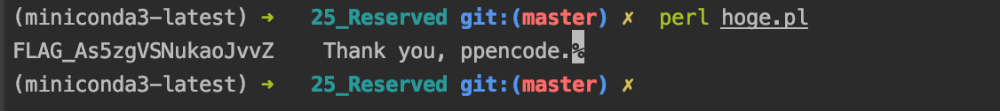

## ksnctf

### 参考
- http://gky360.hatenablog.com/entry/2019/04/16/094409
- https://ctf-master.invhnd.com/category/write-up/ksnctf/


### 02 Easy Cipher

- 概要
    - シーザー暗号
- 解法
    - pythonで、
        - ord() : unicode文字を与えると、unicodeにおけるindexを返す
        - chr() : unicodeにおけるindexを与えると、unicode文字を返す
    - 適当に回してやるとそれっぽいのがでてくる

### 03 Crawling Chaos
- 概要
    - うーにゃーjs
    - (ᒧᆞωᆞ)=(/ᆞωᆞ/),(ᒧᆞωᆞ).ᒧう-
- 解法
    - javascriptではマルチバイト文字を変数に使えるらしい。
    - なので、れっきとしたjsの文法らしい。
    - ここよくわかっていないが、console.log()で、その部分を囲うと、ソースの実体が読めた。(TODO これなぜ？)
    - jsのコードを読むと、与えるべき文字列がわかる
    
### 05_Onion
- 概要
    - よくわからん文字列が与えられる
- 解法
    - base64っぽいので、decodeしても、よくわからない文字列のまま
    - 実はよく見ると、ちょっと文字列が変わっている。
    - base64のフォーマットを保たなくなるまで、decodeループする。
    - すると、
        ```sh
        begin 666 <data>\n51DQ!1U]&94QG4#-3:4%797I74$AU\n \nend\n
        ```
    - こんな感じの文字列になる。
    - これはuuencodeという暗号化の一種のフォーマットらしい。
    - pythonでdecodeしてやると、答えが出る

### 06_Login
- 概要
    - loginフォームのみ
    - SQLインジェクション
    
- 解法
    - 基本の ' or 1=1 -- をIDに入れると、いったんログインできる。
    - すると、phpのソースが表示される
        - adminのpasswordがflagだよ、と書いてある
    - このソースだと、loginが成功したかどうかしかわからず、passwordを出力する手段がない。
    - ブラインドSQLインジェクション
        - sqlを色々叩いて、ログインが成功したかどうかのレスポンスによってそのレコードが存在するかを見る
        - 叩きまくって、レコードの中身を推定する手法
    - インジェクションはやりたい放題なので、
        - length(pass) = i でiをループさせていけば、文字数がわかる
        - substr(pass, i, 1) = c をループさせていけば、i番目の文字の文字がわかる
    -                          
    - おもしろい

### 07 Programming

- 概要
    - インデントが壊れたソースが与えられる。
    - cとして実行すると、flag is wrongとして表示される
    - 答え見た。
    - なんと、whitespaceという空白で記述する別言語らしい。やばすぎ。
    - ideoneに実行環境があった。
        - https://ideone.com/
    - けど、よくわからん。だめっぽい
    - また答え見た。
    - decodeできる環境があるらしい。
        - https://vii5ard.github.io/whitespace/
    - それでもよくわからない。PIN: ~ と標準入力を求められる。
        ```sh 
        push 33355524
        sub
        jz label_0
        ```
        - となってるところがあったので、適当に33355524と打ったらflag出てきたけど、全然わからん。
        - jzは jump if zeroっぽい一応、33355524を引いて0となったら良かったのかな
        - TODO いつかみる
        
    
### 08 Basic is Secure
- 概要
    - basic認証サイトにアクセスしたときのpcapログ?
    - 色々見てたらpasswordがあった。それがflagだった。
    - 
    
### 10 !#
- 概要
    - shebangって知ってる？？

### 12 Hypertext_Preprocessor
- 概要
    - 2012:1823:20:20:02:22:09:54:15:32:48:23:54
    - という文字列のみ。
    - 2012 1823 とぐぐると、CVE-2012-1823　というPHPの脆弱性の話が出てくる。
        - https://blog.tokumaru.org/2012/05/php-cgi-remote-scripting-cve-2012-1823.html
        -  phpで立てたcgiのurlのクエリパラメタに = が含まれない場合、その文字列がコマンドラインオプションとして認識されるというもの
    - http://ctfq.sweetduet.info:10080/~q12/?-s とすると、コードが見れた
    - コードを見ると、Flag is in this directoryとある。
    - 参考URLにあるように、この脆弱性をつくとスクリプトを実行できる。
    - pythonのrequestsから、ls して、catしたら、flagゲットした
    - 
    

### 13 Proverb

- 概要
    - sshして、中で作業
    - proverb という実行ファイルがあり、proverb.txtの中身を出力してるっぽい。
    - permissionが ---s--x--x こうなってる。
        - s は setuid を意味していて、このプログラムは実行するユーザではなくowner権限で実行される。
    - このownerなら、flag.txtが読めるので、どうにかこれを読めるようにしたい
- 解法
    - ln -s flag.txt proverb.txt とする
    - 実行ファイルはproverb.txtを読もうとするので、実体のflagを読んでくれる。
    - 

### 14 John

- 概要
    - /etc/shadowの中身

        ```sh
        $6$sTgBhfj0$pkzz/JpVTl8ZAmk./d4SDarRyWsGSZHguljywUHQMP4DWo8/TgNzL5rMpejqNWuyxtFlISxdyIqPmpsIsyi.i1  
         - -------- --------------------------------------------------------------------------------------
         1    2                                             3
        ```    
        - 1: 暗号化形式
            - $1$ md5
            - $5$ SHA256
            - $6$ SHA512
        - 2: ソルト
            - パスワードに、適当な文字列を足して、ハッシュを計算する方式に使われる文字列
        - 3: ハッシュ
- 解法
    - pythonでがんばると、それぞれのpasswordがわかる
        - hashlib.sha512とbase64でがんばろうとしたが、暗号化は結構色々やってるらしく、無理だった。
            - https://stackoverflow.com/questions/34463134/sha-512-crypt-output-written-with-python-code-is-different-from-mkpasswd/34463995#34463995
        - cryptモジュールだと一発で行ける。
            - なぜかmacだとうまくできなかったのでlinuxでやった。
    - 

- 解法2
   - john the ripper なるpasswordクラック用のソフトがあるらしい。
   - linuxにいれたらすぐできた
       ```sh
       john --wordlist=./dicti0nary_8Th64ikELWEsZFrf.txt ./shadow.txt
       john --show ./shadow.txt  
       ```
### 17 Math 2

- 概要
    - xが与えられる (3900桁)
    - y^101 = x となるyを求める
- 解法
    - pythonは整数なら無限に計算できるが、少数は微妙なので、101乗根を一撃では求められない。
    - 二部探索で、101乗してxより大きい最小の数を求めれば終わり
    - 

### 18 USB flash drive

- 概要
    - drive.img
        - usbのファイルimg　らしい
    - flash用のコマンド群がいくつか使える
        - fls, icatなど
    - 展開すると画像がいっぱい入ってるので、
        - binwalk
        - strings
        - exiftool
        - foremost
        - steghide
        - あたりを試したが、だめ。
            - 変な文字列が先頭にあったのでstegかと思ったが、全然関係なかった
    - fls drive.imgすると、削除された画像があることがわかる
    - また、36-128-1~10までなにか削除されているものがあることがわかる
    - 正直よくわからんが、これもicatすると情報が復元できて、以下のようにやるとflagがでてくる
    -                             
    
### 19 Zip de kure

- 概要
    - パスワードつきのzip
    
- 知見
    - zipは鍵をかけても中のファイル名は除くことができる。
    - 既知平文攻撃
    - pkcrack
    
- 解法
    - ここ参考
        - https://szarny.hatenablog.com/entry/2017/08/26/205230
    - zipの中身の暗号化前のファイルがあれば、それをヒントに全体の暗号化を解除することができるらしい。
    - 中身を見ると、standard-lock-key.jpgとflag.htmlが入っていることがわかる
    - standard-lock-key.jpgは、ググると普通に落ちてるので、これを暗号化前の平文として利用する。
    - pkcrackというツールで攻撃すると、flag.htmlの暗号を解くことができる。
        ```sh
        pkcrack -c Standard-lock-key.jpg -p Standard-lock-key.jpg -C flag.zip -d answer.zip
        ```
    - 
    
### 20 G00913

- 概要
    - 円周率の連続する10桁で最初に現れる素数
- 解法
    - 最初の方に現れるので普通にlog(n)を一個ずつ見てったら見つかる


### 25 Reserved

- 概要
    - ぐぐると、perlの標準関数っぽいことがわかる
    - hoge.plに貼り付けてperlで実行するとflagが出てきた
    - 


### 26 Sherlock_Holmes

- 概要
    - シャーロック・ホームズの小説がはられている。
    - 原文linkもあったので一旦文字列比較してみたが全部同じ。関係なさそう
    - こういう場合は、URLをいじることを考えるらしい。
    - 以下のように、なんか変なURLになっていることがわかる。
        - http://ctfq.sweetduet.info:10080/~q26/index.pl/a_scandal_in_bohemia_1.txt と、なんか
    - http://ctfq.sweetduet.info:10080/~q26/ にアクセスすると、ディレクトリ構造が見れる。
        - ここにflag.txtがある。普通には見えないが、上記のように
        - http://ctfq.sweetduet.info:10080/~q26/index.pl/flag.txtとやると中身が見れる
        - が、source読んでみたら？として書いてない。
    - http://ctfq.sweetduet.info:10080/~q26/index.pl/index.plとすると、ソースが読める。
    - perl勉強
        - chomp : 末尾の改行コードを削除する関数
        - my : 局所変数の定義
        - open(F, "~")して、my $t = <F>すると行のread
        - $ENV{'PATH_INFO'}で、与えられたurlのpathを取得できる
    - つまり、http:~~index.pl/flag.txtとすると、flag.txtを読み取って、出力してるっぽい        
    - で、そこは結局関係なさそう
    - コードを見ると、cracked.txtを読んで、中身が 'hacked'だったらflagをprintしてるっぽい部分もある
        - けど、cracked.txtなんかないし、作れない。
        - index.pl経由でファイルを出力する場合、flag_~を書き換えて出力している。
        - index.plの中身を、index.plを介さず見れれば、flagがかいてありそう
    - perl open文を使ったCGIプログラムの脆弱性 
        - https://www.ipa.go.jp/security/awareness/vendor/programmingv1/a04_01.html
        - ディレクトリトラバーサル
            - $ENV{'PATH_INFO'}に、../../etc/passwdとかをいれると、問答無用で読めてしまう。
            - 今回は関係ない。
        - OSコマンドインジェクション
            - パイプ文字「|」で終了するファイルパスをopen文でオープンすると，パイプ文字を除いたファイルパス部分が指す外部プログラムが実行される
            - http://ctfq.sweetduet.info:10080/~q26/index.pl/ls|
            - とすると、lsコマンドが実行されて、その結果が出力される
    - cat index.plを実行させればよい。
        - パイプが末尾にあると、fileとしてreadした結果として格納されるらしく、flag書き換えこみで出力される。
        - なので、http://ctfq.sweetduet.info:10080/~q26/index.pl/|cat index.pl　とする。
                        
        - 


### 28 Lo-Tech Cipher

- 概要
    - secret.zipがわたされた.
    - unzipすると、2枚の画像があった。画像はただのノイズ
    - binwalkしたらどちらもzipが埋め込まれてるっぽい。
    - けど、unzipできない。どっちも破損してるっぽい
        - zip -FF 1.zip -out ``a.zip | unzip 
        - で、破損してるうちの生きてる部分を取り出せるらしいが、だめ。
    - ノイズだと思われた2枚の画像を重ね合わせると、文字が出てきた。
    - また、secret.zipじたいをbinwalkすると、
        - 
        - pngファイルって書いてある？？
        - unzipできたのに謎って思ったが、拡張子をpngにしてみたら、画像として表示できた
        - pngの終了コードが終わったらその後のバイト列は無視する仕様？
    - 先程の2枚の画像に更に重ね合わせると、答えがでてきた
        - 

FLAG_xWqGGiTkpQpF43mp    
    
### 29 Double Blind

- 概要
    - wordの作成者はだれ？
- 解法
    - 実はword, excelはzip
    - unzipすると、色々ファイルが出てくる。
    - そのなかのdocument.xmlを見ると、/Users/~って感じで名前が出てくる
    - 

### 30 Alpha Mixed Cipher

- 概要
    - 全然わからんかった。
    - http://shimenawa.hatenablog.com/entry/2016/08/19/011827
    - ここ参考にして出しただけ。
    - shellcodeなるものが存在して、それを英数字だけで実現するための手法があるらしい。
    - いつか,また勉強する

### 31 KanGacha

- 概要

- 解法
    - なんで,10じゃ
### 32 Simple Auth
- 参考
    - https://qiita.com/CTFman/items/9224b86a5cbf757ed85e
- phpのstrcasecmpには脆弱性があるらしい。
- strcasecmp($_POST['password'], $password) == 0)
- postクエリのpasswordが、配列だと問答無用で返り値が0になるらしい。
- <input type="password" name="password[]"> nameの中身に[]をつけると、配列として送信できるらしい。
- htmlをこんな漢字にいじって、適当に0とか入れて送信すると通った。

### 35 simple auth 2
$db = new PDO('sqlite:database.db');  
$s = $db->prepare('SELECT * FROM user WHERE id=? AND password=?');  
$s->execute(array($_POST['id'], $_POST['password']));  

- id=? というのは、あとからparameterをもらって実行できるようにするための文法らしい。
- id=' + s + ' みたいにやると、悪意あるユーザに変なsql実行されちゃうらしい。
- この問題では、database.dbの場所がまずくて、普通に相対パスでこのphpと同じ場所にdatabase.dbがあるのでダウンロードできる。
- file コマンドで見ると sqlite3 とわかるので、userを見るとroot, flag~とパスワードが見える
- 


### 36 Are you ESPer?

- 概要
    - バイナリ解析
    - 数当てゲームをやらされる
- 解法
    - IDA free、神ツールだった。
    - かなりわかりやすくassemblyが読める。
    - がんばって追うと、scanfした値 ([esp+3Ch])とrand()を使って計算した値[esp+18h]をcmpしてるのがわかる
        - lea     eax, [esp+3Ch]でeaxにこのアドレスが書き込まれてscanfで値が格納される 
    - 
    - rand()を使って計算してるのは,　このへん
    - 
    - randのシードは、これのちょっと上のところでsrand(time(NULL))してるのがわかる。
    - つまり時刻をあわせてシードを揃えて、rand()をごにゃごにゃしてるところを再実装して、数を当てる。
    - 時刻、2時間以上ずれてた
