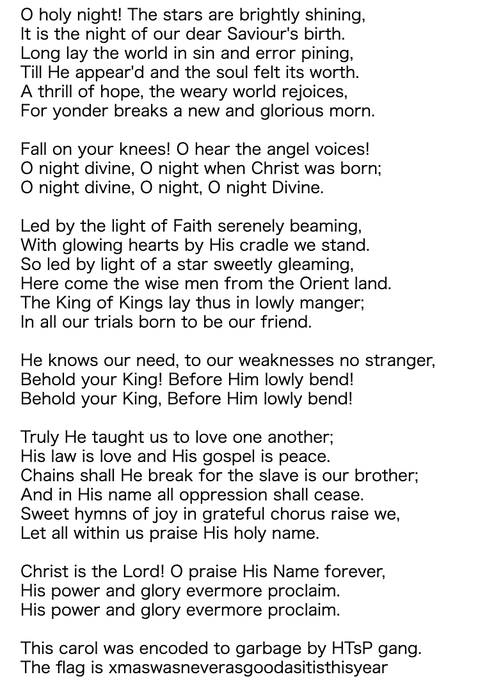
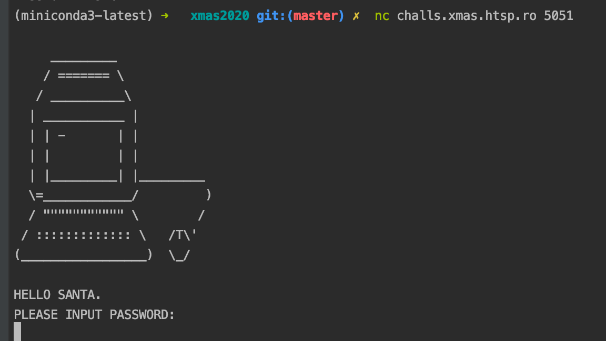
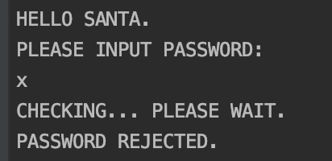
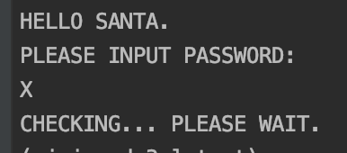
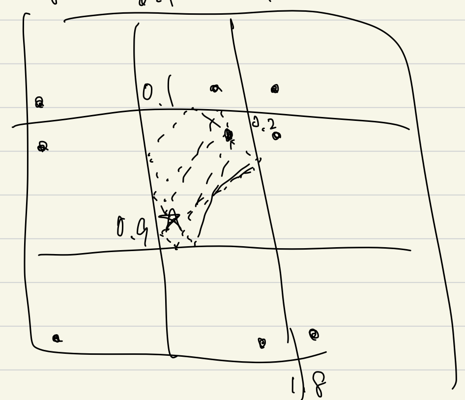

## Xmas CTF 2020 writeup

## Cryptography

### Scrambled Carol 

- 概要
    - 暗号解読系
    - 平文->暗号のscriptと暗号が与えられる。
- 解法
    - scriptを読むと、文字列をbyte codeにしたあとに、0~aの数字をシャッフルしてる
    - asciiなので、だいたい0x30~0x7Aまでしかとらないのでbyteの1文字目のシャッフルの対応がなんとなくわかる
    - あとは、改行コード、スペースとかで当たりつけて、
    - 暗号内の文字頻度と英語としての文字の頻度を照らし合わせていくつか試すと、
    - O holy night的な文字になったので、ぐぐるとそういうキャロルがあるらしいのでちょっと違うところを訂正すると、
    -     

### Santa's public key factory 

- 概要
    - RSA attack
    - 暗号化scriptが与えられる
    - サーバに問い合わせるたびに新しい鍵が生成されて、公開鍵と固定のflag文字列を暗号化したものが与えられる
    - 上記は255回までできて、256回目でflag文字列を当てるというもの
- 解法
    - first try
        - 同一の平文に対し、異なるn, eで暗号化したものが複数与えられる、という性質から
        - Hastad broadcast attackが使える？と思ったが
            - http://inaz2.hatenablog.com/entry/2016/01/15/011138
        - これはe個分のペアが必要らしく、e=65537固定なので絶対無理だった。
    - second try
        - 鍵生成のアルゴリズムを見ると、p, q生成時にたかだか65536通りの素数から乱択していることがわかる
        - つまり、255回も生成したら、どれかのペアは同じ素数をnに使う確率が高い
        - 同じ素数を使っていたら、n同士が公約数を持つので、p,qに素因数分解が可能
        - p,qさえわかればphi計算してd求めて復号できるのでOK
      

### Help a Santa helper? 

- 概要
    - AES CBC
        - https://qiita.com/opengl-8080/items/85df520e2d8c4e19be8e
    - Santa's public key factoryと同様の問題設定
    - msgを与えて、そのhash結果が一回だけ与えられる
    - その後、hashが衝突するようなmsg1, msg2を与えられればOK
- 解法
    - コードを読むと、16byteのブロックごとに、hash = encrypt(hash xor msg) xor msg みたいになってる
        - 随時paddingも入ってるが、あんま関係ない
        - \x00で埋まったmsgを渡すと、encrypt(0)がわかる
        - 次に、\x00 ... + encrypt(0)をhashすると、hash xor msg = 0なので、hash = 0になる
        - つまり、\x00... と、\x00.. + encrypt(0) + \x00.. はともにencrypt(0)になる
        - 終わり

###  Too low voltage 

- 概要
    - これも同様の問題設定
    - 暗号化scriptが与えられる
    - 鍵生成は１度だけ。
    - サーバに問い合わせるたびに、msg -> msg^d を返してくれる
    - 上記は63回までできて、64回目で、ランダムmsgが与えられるので、msg -> msg^dを求める。
- 解法
    - 解けなかった。。。答え見たけどもう少し頑張れば絶対解けた。。。
    - https://ctftime.org/writeup/25423
    - 計算結果はmsg -> msg^dだが、CRT-RSAという高速計算で求めている
        - https://www.ipa.go.jp/security/enc/CRYPTREC/fy15/documents/49rep.pdf
    - CRT-RSAには、計算途中でランダムエラーが発生した場合に、s' ≠ msg^d, s = msg^d が与えられると、
    - Bellcore攻撃というものがあってN = p*qのqが求まるらしい
    - 困難起こるわけ無いやんと思っていたが、この問題では、工場が電圧不足になっているという設定なので
    たまにエラーが発生する。
    - つまり63回やってs=msg^dとして帰ってきたものとs^e==msgとならなければエラーなので、計算ができる

## Hardware

### Santa Computing 

- 概要
    - 
    - これ以外の情報なし
- 解法
    - 解けず
    - https://github.com/qxxxb/ctf/tree/master/2020/xmas_ctf/santa_computing
    - 適当にpassword打つと、
    - 
    - 
    - という感じで、REJECTEDが出ない時がある。
    - つまり、与えた文字列の方をパースしてpasswordと比較しているのでは？という予測ができる
    - そうなると、一文字ずつ合致しているのを進めていくといけるらしい
    - 分類としては、サイドチャネル攻撃というらしい。
        - 処理時間など、暗号結果でない要素から情報を抜き取る方法らしい
## Misc

### Bobi's Whacked 
- 概要
    - Warm socks and warm wine, so the caption said.
    - こんだけ
- 解法
    - 去年のwriteupを見ると、bobi whackedというyoutube channelがある
    - 一見普通のやつ。
    - captionといっているので、動画の字幕ファイルをダウンロードしてみると、flagの一部があった
    - あと、channelの概要欄を見ると、656A~~ みたいに書いてあってASCIIっぽいなーと思ったのでdecodeしたら文字列になったので
    - 終わり
    
### Krampus' Lazer Tag 
- 概要
    - 1x1の正方形の空間に自分と敵がいて、敵がレーザを持っている
    - 空間の壁は全面ミラー張りで100%反射する
    - レーザの長さの中間点に一瞬収束する。
    - 自分は16個のブロックを置くことができて、レーザが収束する点におくとレーザを止めることができる
- 解法
    - めちゃめちゃいい問題だった。
    - はじめは、鏡張りで何回反射しても良いはずだし、中間点の意味が全くわからなかった。
    - discordのQAを読むと、確かにレーザを当てるための発射角度は無限通りあるけど、、みたいなことがあった。
    - なんとなく、発射角度は無限だけど、中間点は16個とかになったりする？と予想。これがあってた。
    - 
    - 一回反射するとその壁を対称に自分の位置を配置。
        - 自分の位置は実質4通りしかない
    - 複数回反射する場合も同様にこんな感じでかけて、当日は適当に10回反射くらいまで試して、16通りの中間点に集約することを確認。
    - 上下方向だけ見たときに、結局4通りしかないから4x4しかないって感じかな

### RCA 
- 概要
    - javascriptが動くページ
    - ライフゲームっぽい感じでセルが表示されていて、
    - 10秒ごとにセルが更新される
    - 画面にmerry Xmasと表示
- 解法
    - ページを読み込んだときに、特定の時刻から現在時刻までの更新が行われる
    - コードをちゃんと読むと、特定の時刻Bからの時刻更新がされていて、時刻Aがstartと表示されている
    - これに気づかず、merry xmasと出てるのでxmasのUTCまで更新させたが違った。
    - 逆で、特定の時刻Aまで戻すと、セルで文字が表示された。
        - 戻すのは順方向の更新と逆の更新を実装するだけ
        - あと、10秒ごとの更新を止めるのも少し工夫が必要だった

## Programming

### Many Paths 

- 概要
    - 完全に競プロ
    - 無向グラフと隣接行列が与えられる
    - ノード1 -> ノードN までのパスの長さがLとなるようなパスの組み合わせ
    - 同じノードを何回通っても良い
- 解法
    - N,Lが大きいので普通にDPすると間に合わない
    - ノード1から各ノードへ2回の移動で到達するパスの組み合わせは、
    ノード1から各ノードへ1回の移動でいけるパスの組み合わせを隣接行列に従って足し上げたものなので
    - 行列累乗で高速化できる
  
### Slowest Fastest 

- 概要
    - 完全に競プロ
    - A[N]の仕事があって、一日にK人がP個、N-K人がQ個の仕事ができる
    - 何日で終わるか
- 解法
    - P>Qとする。
    - 愚直解は、毎日残りが多い方からK人を割り当てて、ソートを繰り返す
    - 二部探索して、X日でできるかを考える。
    - Q * Xをとりあえず引いて、各残りの仕事をP-Qでこなすとしたら、
    何人日必要かをそれぞれ数え上げて、それぞれがX以下で、全体の和がX * Kで収まればうまくいく
    - 割とギリギリだけど間に合った
    
    
### Santa's ELF holomorphing machine 

- 概要
    - 複素数の正則関数。。
- 解法
    - 解けず
    - 複素数における正則関数というのは、コーシーリーマンの方程式を満たす必要があるらしい
    - ぐぐればとけたなぁ。。
